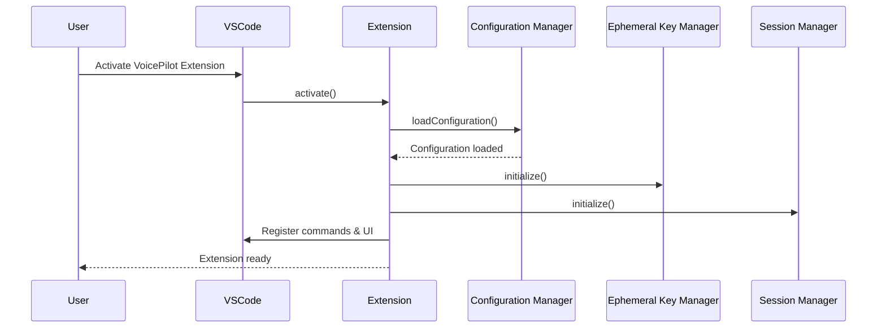
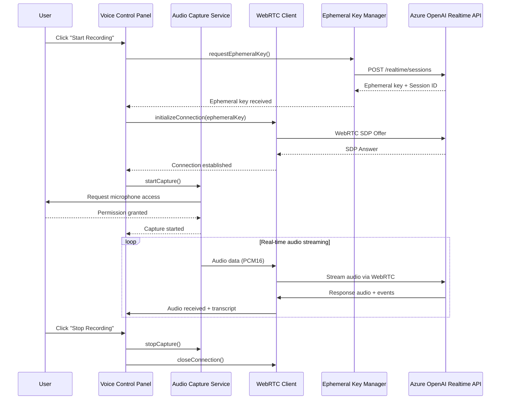
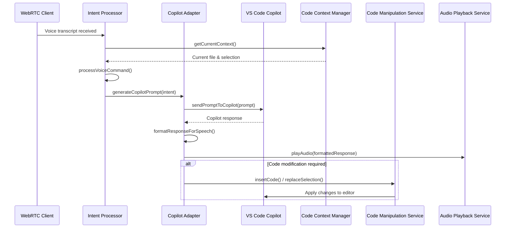
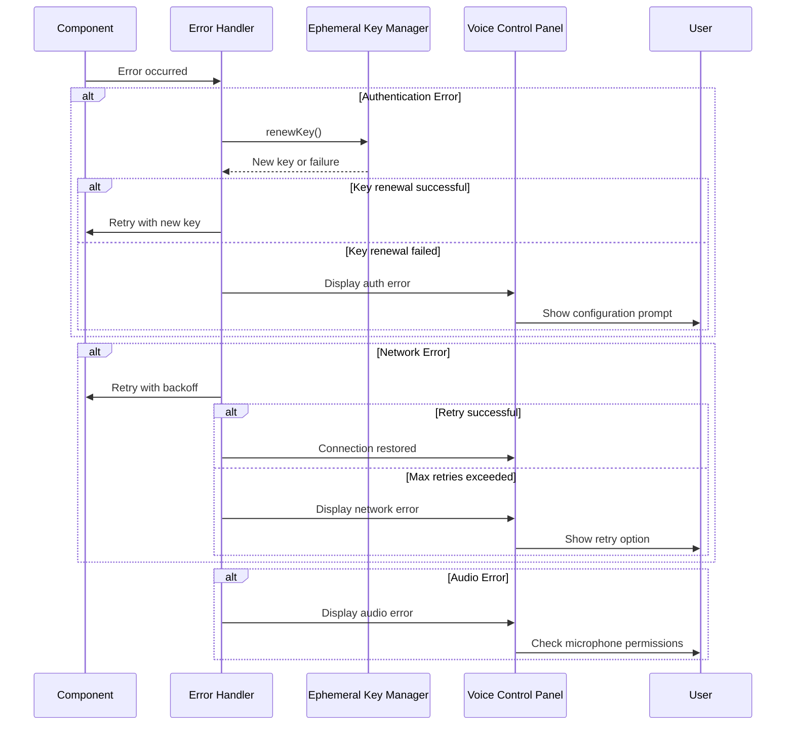
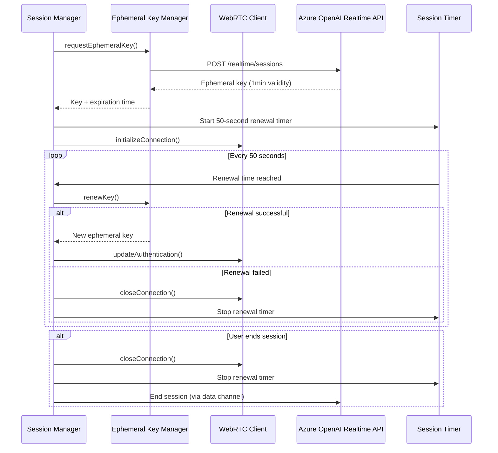
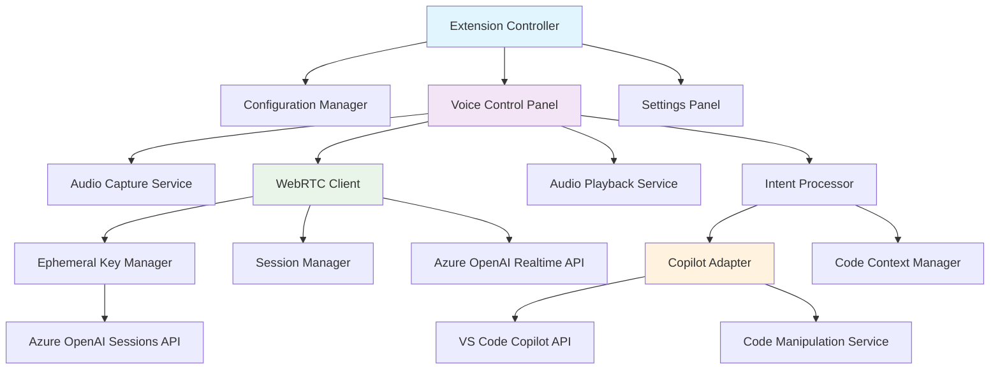

# VoicePilot Extension Components Design

## Overview

VoicePilot is a VS Code extension that enables hands/eyes free interaction with GitHub Copilot for specification writing, project planning, and task management using Azure OpenAI's GPT Realtime API via WebRTC. This document outlines the component architecture and interaction flows required for voice-driven planning sessions, document creation, and project ideation that leverages Copilot's existing system context and MCP server integrations.

## Architecture Principles

- **Client-Side Processing**: Both client and server components run within the VS Code extension
- **WebRTC for Real-time Audio**: Use WebRTC for low-latency audio streaming to Azure OpenAI Realtime API
- **Secure Authentication**: Implement ephemeral key pattern for secure communication
- **Modular Design**: Loosely coupled components for maintainability and testability

## Core Components

### 1. Audio Management Layer

#### 1.1 WebRTC Client (`src/audio/webrtcClient.ts`)

**Responsibilities:**

- Establish WebRTC peer connection to Azure OpenAI Realtime API
- Handle SDP offer/answer negotiation
- Manage audio tracks and data channels
- Process real-time audio streams

**Key Methods:**

- `initializeConnection(ephemeralKey: string): Promise<void>`
- `startAudioStream(): void`
- `stopAudioStream(): void`
- `sendAudioData(audioData: ArrayBuffer): void`
- `onAudioReceived(callback: (audio: ArrayBuffer) => void): void`

#### 1.2 Audio Capture Service (`src/audio/audioCaptureService.ts`)

**Responsibilities:**

- Capture microphone input using Web Audio API
- Handle audio format conversion (PCM16)
- Implement noise reduction and echo cancellation
- Manage recording state

**Key Methods:**

- `startCapture(): Promise<MediaStream>`
- `stopCapture(): void`
- `getAudioData(): ArrayBuffer`
- `setAudioConstraints(constraints: MediaTrackConstraints): void`

#### 1.3 Audio Playback Service (`src/audio/audioPlaybackService.ts`)

**Responsibilities:**

- Play received audio from Azure OpenAI
- Handle audio buffering and synchronization
- Manage volume and playback controls

**Key Methods:**

- `playAudio(audioData: ArrayBuffer): void`
- `pausePlayback(): void`
- `resumePlayback(): void`
- `setVolume(level: number): void`

### 2. Authentication & Session Management

#### 2.1 Ephemeral Key Manager (`src/auth/ephemeralKeyManager.ts`)

**Responsibilities:**

- Request ephemeral keys from Azure OpenAI Sessions API
- Cache and manage key lifecycle (1-minute validity)
- Handle key renewal and rotation

**Key Methods:**

- `requestEphemeralKey(): Promise<string>`
- `isKeyValid(): boolean`
- `renewKey(): Promise<string>`

#### 2.2 Session Manager (`src/session/sessionManager.ts`)

**Responsibilities:**

- Manage Realtime API sessions
- Handle session configuration and updates
- Coordinate session lifecycle events

**Key Methods:**

- `createSession(config: SessionConfig): Promise<string>`
- `updateSession(sessionId: string, config: Partial<SessionConfig>): void`
- `endSession(sessionId: string): void`

### 3. Copilot Integration Layer

#### 3.1 Copilot Adapter (`src/copilot/copilotAdapter.ts`)

**Responsibilities:**

- Interface with VS Code Copilot Chat extension
- Convert voice planning discussions to Copilot prompts
- Handle specification and planning responses for optimal voice delivery
- Leverage Copilot's existing system context (codebase, design docs)
- Utilize Copilot's MCP server integrations without reimplementation

**Key Methods:**

- `sendPlanningPromptToCopilot(prompt: string): Promise<string>`
- `formatSpecificationForSpeech(response: string): string`
- `extractActionItems(response: string): ActionItem[]`
- `createSpecificationDocument(content: string): Promise<string>`

#### 3.2 Intent Processor (`src/copilot/intentProcessor.ts`)

**Responsibilities:**

- Parse voice input for planning and specification intentions
- Map voice discussions to specific planning actions (requirements, architecture, tasks)
- Generate appropriate prompts for Copilot's planning capabilities
- Identify when existing system context is needed

**Key Methods:**

- `processPlanningCommand(transcript: string): PlanningIntent`
- `generateSpecificationPrompt(intent: PlanningIntent): string`
- `extractRequirements(discussion: string): Requirement[]`
- `identifySystemContext(intent: PlanningIntent): ContextRequest`

### 4. Planning & Specification Layer

#### 4.1 Project Context Manager (`src/planning/projectContextManager.ts`)

**Responsibilities:**

- Analyze current project and codebase context for informed planning
- Extract relevant architecture and design information
- Leverage Copilot's existing context awareness
- Provide system understanding for specification discussions

**Key Methods:**

- `getCurrentProjectContext(): ProjectContext`
- `getArchitectureOverview(): ArchitectureInfo`
- `getRelevantDesignDocs(): DesignDocument[]`
- `analyzeExistingFeatures(): FeatureInventory`

#### 4.2 Specification Management Service (`src/planning/specificationService.ts`)

**Responsibilities:**

- Create and manage specification documents from voice discussions
- Generate requirements, architecture docs, and planning artifacts
- Integrate with existing documentation workflows
- Track planning session outcomes and action items

**Key Methods:**

- `createSpecificationDocument(content: SpecificationContent): Promise<string>`
- `updateRequirements(requirements: Requirement[]): void`
- `generateArchitectureDoc(discussion: ArchitectureDiscussion): string`
- `extractActionItems(session: PlanningSession): ActionItem[]`

### 5. UI Components

#### 5.1 Voice Control Panel (`src/ui/voiceControlPanel.ts`)

**Responsibilities:**

- Provide voice recording controls
- Display connection status and session info
- Show real-time transcription

**Features:**

- Start/Stop recording button
- Connection status indicator
- Live transcription display
- Volume meters

#### 5.2 Settings Panel (`src/ui/settingsPanel.ts`)

**Responsibilities:**

- Configure Azure OpenAI endpoints and keys
- Adjust audio settings and preferences
- Manage voice command mappings

**Features:**

- Azure credentials configuration
- Audio device selection
- Voice sensitivity settings
- Custom command configuration

### 6. Core Extension Services

#### 6.1 Extension Controller (`src/extension.ts`)

**Responsibilities:**

- Coordinate all extension components
- Handle VS Code extension lifecycle
- Register commands and event handlers

#### 6.2 Configuration Manager (`src/config/configurationManager.ts`)

**Responsibilities:**

- Load and validate extension settings
- Manage Azure endpoint configurations
- Handle environment-specific settings

## Sequence Diagrams

### 1. Extension Initialization Sequence

### 2. Voice Recording and Processing Sequence

### 3. Copilot Integration Sequence

### 4. Error Handling and Recovery Sequence

### 5. Session Lifecycle Management

## Component Dependencies

## Configuration Requirements

### Azure OpenAI Settings

- `voicepilot.azureOpenAI.endpoint`: Azure OpenAI resource endpoint
- `voicepilot.azureOpenAI.apiKey`: Azure OpenAI API key
- `voicepilot.azureOpenAI.deploymentName`: Realtime model deployment name
- `voicepilot.azureOpenAI.region`: Azure region (eastus2 or swedencentral)

### Audio Settings

- `voicepilot.audio.inputDevice`: Preferred microphone device
- `voicepilot.audio.outputDevice`: Preferred speaker device
- `voicepilot.audio.noiseReduction`: Enable noise reduction
- `voicepilot.audio.echoCancellation`: Enable echo cancellation
- `voicepilot.audio.sampleRate`: Audio sample rate (default: 24000)

### Voice Command Settings

- `voicepilot.commands.wakeWord`: Wake word for activation
- `voicepilot.commands.sensitivity`: Voice detection sensitivity
- `voicepilot.commands.timeout`: Command timeout in seconds

## Security Considerations

1. **API Key Protection**: Never expose Azure OpenAI API keys in client-side code
2. **Ephemeral Key Management**: Implement secure key rotation every 50 seconds
3. **Audio Privacy**: Ensure audio data is only sent to authorized Azure endpoints
4. **Permission Management**: Request minimal necessary permissions for microphone access
5. **Error Handling**: Avoid exposing sensitive information in error messages

## Performance Optimization

1. **Audio Buffering**: Implement efficient audio buffering to minimize latency
2. **Connection Pooling**: Reuse WebRTC connections when possible
3. **Lazy Loading**: Load components only when needed
4. **Memory Management**: Properly dispose of audio streams and WebRTC connections
5. **Caching**: Cache frequently used configurations and context data

## Testing Strategy

1. **Unit Tests**: Test individual components in isolation
2. **Integration Tests**: Test component interactions and API calls
3. **Audio Tests**: Test with various microphone setups and audio conditions
4. **Network Tests**: Test with different network conditions and failures
5. **User Acceptance Tests**: Test complete voice command workflows

## Implementation Priority

### Phase 1: Core Audio Pipeline

1. WebRTC Client implementation
2. Audio Capture Service
3. Ephemeral Key Manager
4. Basic UI controls

### Phase 2: Copilot Integration

1. Intent Processor
2. Copilot Adapter
3. Code Context Manager
4. Code Manipulation Service

### Phase 3: Enhanced Features

1. Advanced voice commands
2. Settings management
3. Error recovery mechanisms
4. Performance optimizations

This design provides a solid foundation for implementing the VoicePilot extension with proper separation of concerns, secure authentication, and efficient real-time audio processing.
