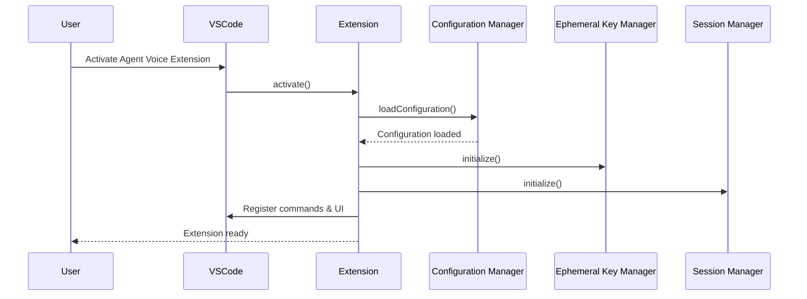
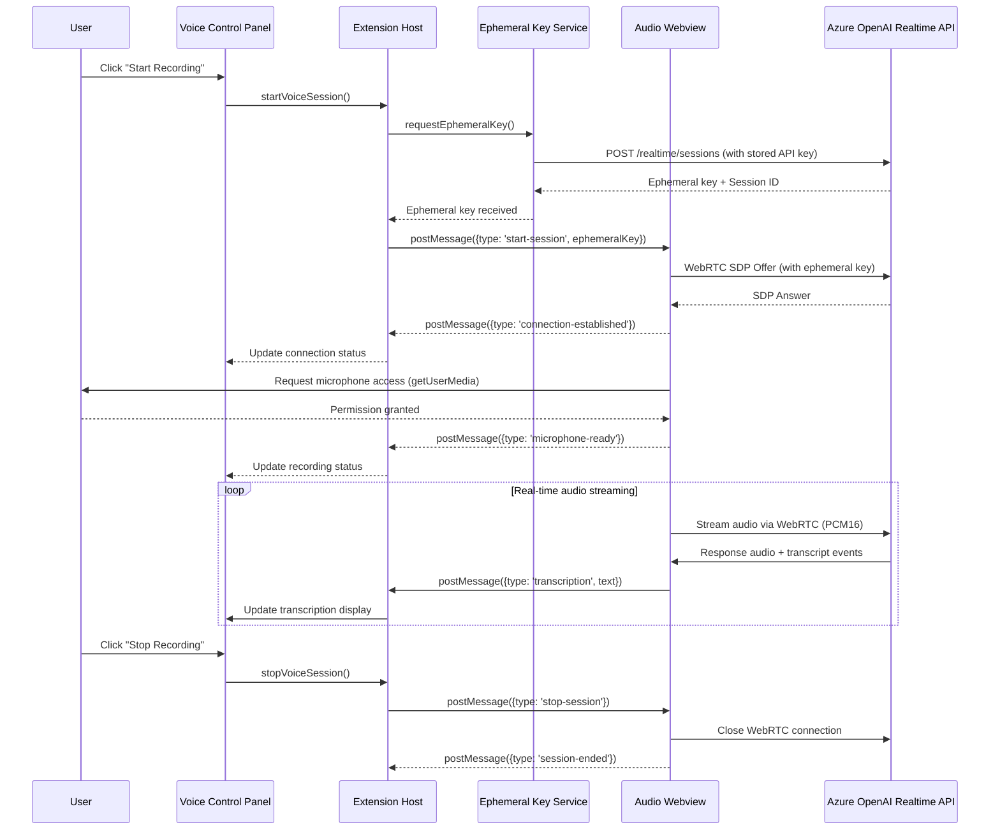
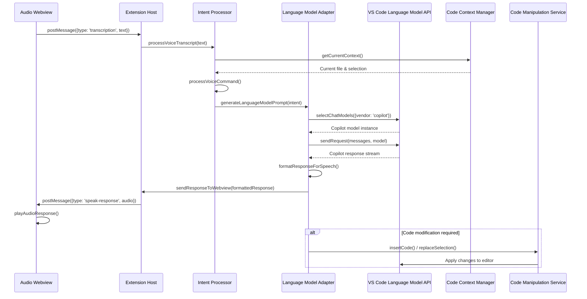
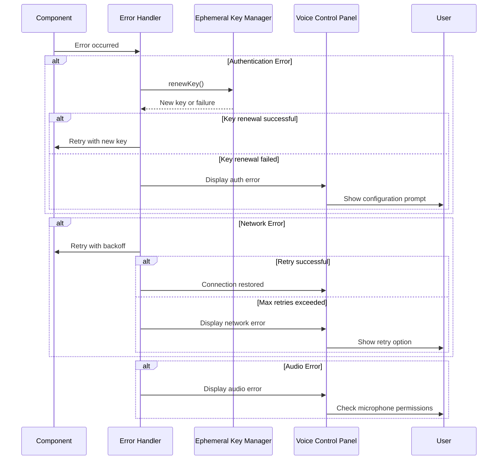
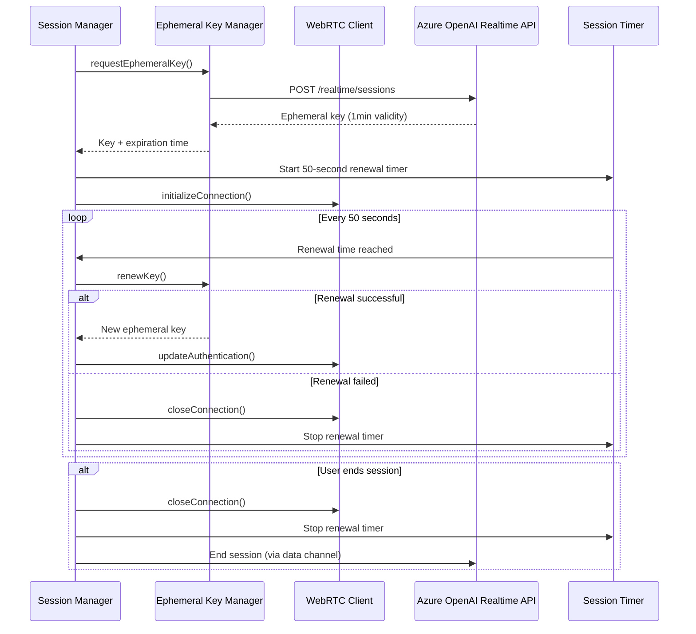
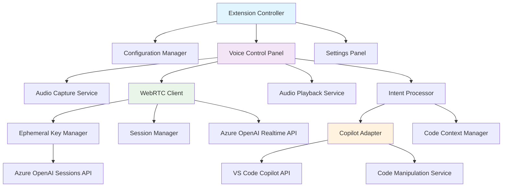

# Agent Voice Extension Components Design

## Overview

Agent Voice is a VS Code extension that enables hands/eyes free interaction with GitHub Copilot for specification writing, project planning, and task management using Azure OpenAI's GPT Realtime API via WebRTC. This document outlines the component architecture and interaction flows required for voice-driven planning sessions, document creation, and project ideation that leverages Copilot's existing system context and MCP server integrations.

## Architecture Principles

- **Webview-Based Audio Processing**: Audio capture and Azure integration run in VS Code webview context for Web API access
- **Extension Host Coordination**: Extension host manages VS Code integration, commands, and Copilot communication
- **WebRTC for Real-time Audio**: Use WebRTC for low-latency audio streaming to Azure OpenAI Realtime API
- **Secure Authentication**: Implement ephemeral key pattern with backend service for secure communication
- **Message Passing Architecture**: Bidirectional communication between extension host and webview
- **Modular Design**: Loosely coupled components for maintainability and testability

## Core Components

### 1. Webview Audio Processing Layer

#### 1.1 Audio Webview (`src/webview/audioWebview.ts`)

**Responsibilities:**

- Host webview for audio processing with Web API access
- Manage webview lifecycle and message passing
- Handle Content Security Policy configuration
- Coordinate between extension host and webview audio context

**Key Methods:**

- `createAudioWebview(): vscode.WebviewPanel`
- `postMessage(message: AudioMessage): void`
- `onMessage(callback: (message: AudioMessage) => void): void`
- `dispose(): void`

**CSP Configuration:**

```typescript
const csp = `
  default-src 'none';
  script-src 'self' 'unsafe-inline';
  style-src 'self' 'unsafe-inline';
  media-src 'self';
  connect-src https://*.openai.azure.com wss://*.azure.com;
`;
```

#### 1.2 WebRTC Audio Client (Webview Context: `src/webview/webrtcAudioClient.js`)

**Responsibilities:**

- Establish WebRTC peer connection to Azure OpenAI Realtime API from webview
- Handle microphone access via getUserMedia() Web API
- Manage real-time audio streaming and processing
- Process Azure OpenAI audio responses

**Key Methods:**

- `initializeWebRTCConnection(ephemeralKey: string): Promise<void>`
- `startMicrophoneCapture(): Promise<MediaStream>`
- `streamAudioToAzure(audioData: ArrayBuffer): void`
- `onAudioReceived(callback: (audio: ArrayBuffer) => void): void`
- `closeConnection(): void`

#### 1.3 Audio Processing Service (Webview Context: `src/webview/audioProcessingService.js`)

**Responsibilities:**

- Handle Web Audio API processing within webview
- Convert audio formats (PCM16) for Azure OpenAI compatibility
- Implement real-time audio processing and filtering
- Manage audio quality and noise reduction

**Key Methods:**

- `createAudioContext(): AudioContext`
- `processAudioStream(stream: MediaStream): AudioWorkletNode`
- `convertToPCM16(audioBuffer: AudioBuffer): ArrayBuffer`
- `applyNoiseReduction(audioData: ArrayBuffer): ArrayBuffer`

### 2. Authentication & Session Management

#### 2.1 Ephemeral Key Backend Service (`src/auth/ephemeralKeyService.ts`)

**Responsibilities:**

- Securely store Azure OpenAI API keys in VS Code secret storage
- Mint ephemeral keys using backend service pattern
- Handle key renewal and rotation (1-minute validity)
- Never expose standard API keys to webview context

**Key Methods:**

- `requestEphemeralKey(): Promise<string>`
- `storeApiKey(apiKey: string): Promise<void>`
- `isKeyValid(ephemeralKey: string): boolean`
- `renewEphemeralKey(): Promise<string>`

**Security Pattern:**

```typescript
// Extension host only - NEVER in webview
class EphemeralKeyService {
  private async mintEphemeralKey(): Promise<string> {
    const apiKey = await this.context.secrets.get('azure-openai-key');
    // Use standard API key to request ephemeral key from Azure
    const response = await fetch(`${endpoint}/openai/realtimeapi/sessions`, {
      headers: { 'api-key': apiKey }
    });
    return response.json().ephemeralKey;
  }
}
```

#### 2.2 Session Manager (`src/session/sessionManager.ts`)

**Responsibilities:**

- Coordinate session lifecycle between extension host and webview
- Manage session configuration and updates
- Handle session termination and cleanup
- Orchestrate ephemeral key delivery to webview

**Key Methods:**

- `createSession(config: SessionConfig): Promise<string>`
- `deliverEphemeralKeyToWebview(key: string): void`
- `updateSession(sessionId: string, config: Partial<SessionConfig>): void`
- `endSession(sessionId: string): void`

### 3. Copilot Integration Layer

#### 3.1 Language Model Adapter (`src/copilot/languageModelAdapter.ts`)

**Responsibilities:**

- Interface with VS Code Language Model API (`vscode.lm`) for direct Copilot access
- Register as chat participant (@agentvoice) for conversational interface
- Convert voice planning discussions to language model prompts
- Handle specification and planning responses for optimal voice delivery
- Leverage Copilot's existing system context and MCP server integrations

**Key Methods:**

- `getCopilotModels(): Promise<vscode.LanguageModelChat[]>`
- `sendPromptToLanguageModel(prompt: string, model: vscode.LanguageModelChat): Promise<string>`
- `registerChatParticipant(): vscode.ChatParticipant`
- `formatResponseForSpeech(response: string): string`
- `extractActionItems(response: string): ActionItem[]`

**Primary Integration Pattern:**

```typescript
class LanguageModelAdapter {
  async initializeCopilotAccess(): Promise<void> {
    // Direct language model access
    const [model] = await vscode.lm.selectChatModels({
      vendor: 'copilot',
      family: 'gpt-4o'
    });

    // Register chat participant
    const participant = vscode.chat.createChatParticipant('agentvoice', this.handleChatRequest);
  }
}
```

#### 3.2 Intent Processor (`src/copilot/intentProcessor.ts`)

**Responsibilities:**

- Parse voice input for planning and specification intentions
- Map voice discussions to specific planning actions (requirements, architecture, tasks)
- Generate appropriate prompts for language model capabilities
- Identify when existing system context is needed
- Handle both direct language model calls and chat participant interactions

**Key Methods:**

- `processPlanningCommand(transcript: string): PlanningIntent`
- `generateLanguageModelPrompt(intent: PlanningIntent): vscode.LanguageModelChatMessage[]`
- `extractRequirements(discussion: string): Requirement[]`
- `identifySystemContext(intent: PlanningIntent): ContextRequest`
- `handleChatParticipantRequest(request: vscode.ChatRequest): Promise<void>`

### 4. Planning & Specification Layer

#### 4.1 Project Context Manager (`src/planning/projectContextManager.ts`)

**Responsibilities:**

- Analyze current project and codebase context for informed planning
- Extract relevant architecture and design information
- Leverage Copilot's existing context awareness
- Provide system understanding for specification discussions

**Key Methods:**

- `getCurrentProjectContext(): ProjectContext`
- `getArchitectureOverview(): ArchitectureInfo`
- `getRelevantDesignDocs(): DesignDocument[]`
- `analyzeExistingFeatures(): FeatureInventory`

#### 4.2 Specification Management Service (`src/planning/specificationService.ts`)

**Responsibilities:**

- Create and manage specification documents from voice discussions
- Generate requirements, architecture docs, and planning artifacts
- Integrate with existing documentation workflows
- Track planning session outcomes and action items

**Key Methods:**

- `createSpecificationDocument(content: SpecificationContent): Promise<string>`
- `updateRequirements(requirements: Requirement[]): void`
- `generateArchitectureDoc(discussion: ArchitectureDiscussion): string`
- `extractActionItems(session: PlanningSession): ActionItem[]`

### 5. UI Components

#### 5.1 Voice Control Panel (`src/ui/voiceControlPanel.ts`)

**Responsibilities:**

- Coordinate between extension host and webview for voice controls
- Display connection status and session info
- Show real-time transcription from webview
- Handle user interaction and pass commands to webview

**Features:**

- Start/Stop recording button (sends messages to webview)
- WebRTC connection status indicator
- Live transcription display from webview messages
- Volume meters and audio quality indicators
- Permission status and troubleshooting guidance

**Message Passing Pattern:**

```typescript
class VoiceControlPanel {
  private sendToWebview(command: 'start' | 'stop' | 'configure'): void {
    this.webview.postMessage({ type: 'audio-command', command });
  }

  private onWebviewMessage(message: AudioMessage): void {
    switch (message.type) {
      case 'transcription': this.updateTranscription(message.text); break;
      case 'status': this.updateConnectionStatus(message.status); break;
    }
  }
}
```

#### 5.2 Settings Panel (`src/ui/settingsPanel.ts`)

**Responsibilities:**

- Configure Azure OpenAI endpoints and keys
- Adjust audio settings and preferences
- Manage voice command mappings

**Features:**

- Azure credentials configuration
- Audio device selection
- Voice sensitivity settings
- Custom command configuration

### 6. Core Extension Services

#### 6.1 Extension Controller (`src/extension.ts`)

**Responsibilities:**

- Coordinate all extension components
- Handle VS Code extension lifecycle
- Register commands and event handlers

#### 6.2 Configuration Manager (`src/config/configurationManager.ts`)

**Responsibilities:**

- Load and validate extension settings
- Manage Azure endpoint configurations
- Handle environment-specific settings

## Sequence Diagrams

### 1. Extension Initialization Sequence



### 2. Voice Recording and Processing Sequence



### 3. Copilot Integration Sequence



### 4. Error Handling and Recovery Sequence



### 5. Session Lifecycle Management



## Component Dependencies



## Configuration Requirements

### Azure OpenAI Settings

- `agentvoice.azureOpenAI.endpoint`: Azure OpenAI resource endpoint
- `agentvoice.azureOpenAI.deploymentName`: Realtime model deployment name
- `agentvoice.azureOpenAI.region`: Azure region (eastus2 or swedencentral)
- **API Key Storage**: Stored securely in VS Code secret storage, never in settings

### Webview Security Configuration

- **Content Security Policy**:

  ```csp
  default-src 'none';
  script-src 'self' 'unsafe-inline';
  style-src 'self' 'unsafe-inline';
  media-src 'self';
  connect-src https://*.openai.azure.com wss://*.azure.com;
  ```

- **Local Resource Roots**: Configured for webview asset loading
- **Enable Scripts**: Required for Web Audio API and WebRTC functionality

### Audio Settings

- `agentvoice.audio.inputDevice`: Preferred microphone device
- `agentvoice.audio.outputDevice`: Preferred speaker device
- `agentvoice.audio.noiseReduction`: Enable noise reduction
- `agentvoice.audio.echoCancellation`: Enable echo cancellation
- `agentvoice.audio.sampleRate`: Audio sample rate (default: 24000)

### Voice Command Settings

- `agentvoice.commands.wakeWord`: Wake word for activation
- `agentvoice.commands.sensitivity`: Voice detection sensitivity
- `agentvoice.commands.timeout`: Command timeout in seconds

## Security Considerations

1. **API Key Protection**: Store Azure OpenAI API keys in VS Code secret storage, never in webview context
2. **Ephemeral Key Backend Service**: Extension host mints ephemeral keys, webview only receives time-limited keys
3. **Webview Isolation**: Audio processing isolated in webview with strict CSP configuration
4. **Message Passing Security**: Validate all messages between extension host and webview
5. **Audio Privacy**: Ensure audio data is only sent to authorized Azure endpoints via HTTPS/WSS
6. **Permission Management**: Handle microphone permissions gracefully with user guidance
7. **Cross-Origin Security**: Webview CSP prevents unauthorized external connections
8. **Error Handling**: Avoid exposing sensitive information in error messages or webview console

## Performance Optimization

1. **Audio Buffering**: Implement efficient audio buffering to minimize latency
2. **Connection Pooling**: Reuse WebRTC connections when possible
3. **Lazy Loading**: Load components only when needed
4. **Memory Management**: Properly dispose of audio streams and WebRTC connections
5. **Caching**: Cache frequently used configurations and context data

## Testing Strategy

1. **Unit Tests**: Test individual components in isolation
2. **Integration Tests**: Test component interactions and API calls
3. **Audio Tests**: Test with various microphone setups and audio conditions
4. **Network Tests**: Test with different network conditions and failures
5. **User Acceptance Tests**: Test complete voice command workflows

## Implementation Priority

### Phase 1: Core Audio Pipeline

1. WebRTC Client implementation
2. Audio Capture Service
3. Ephemeral Key Manager
4. Basic UI controls

### Phase 2: Copilot Integration

1. Intent Processor
2. Copilot Adapter
3. Code Context Manager
4. Code Manipulation Service

### Phase 3: Enhanced Features

1. Advanced voice commands
2. Settings management
3. Error recovery mechanisms
4. Performance optimizations

This design provides a solid foundation for implementing the Agent Voice extension with proper separation of concerns, secure authentication, and efficient real-time audio processing.
