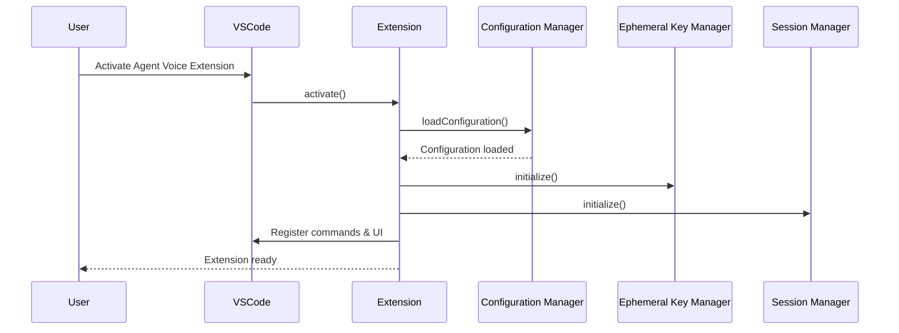
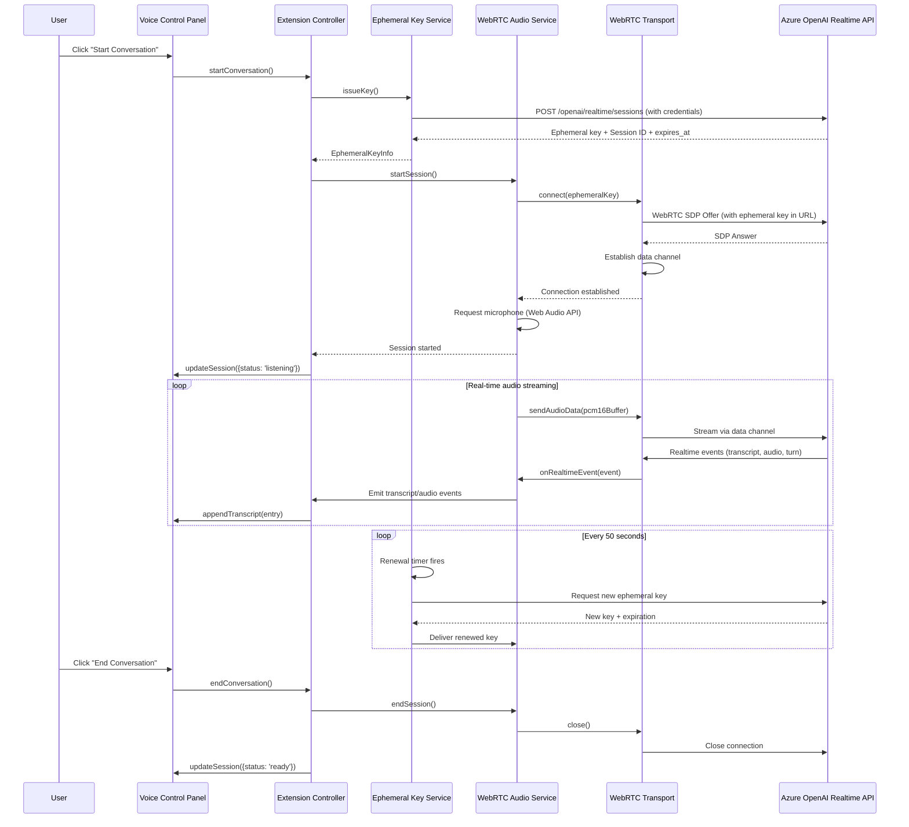
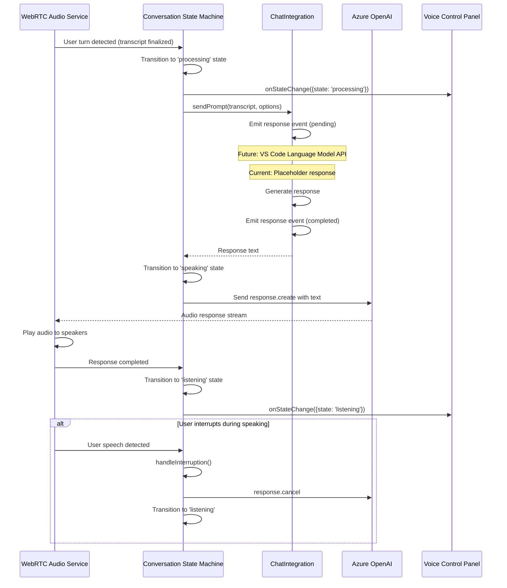
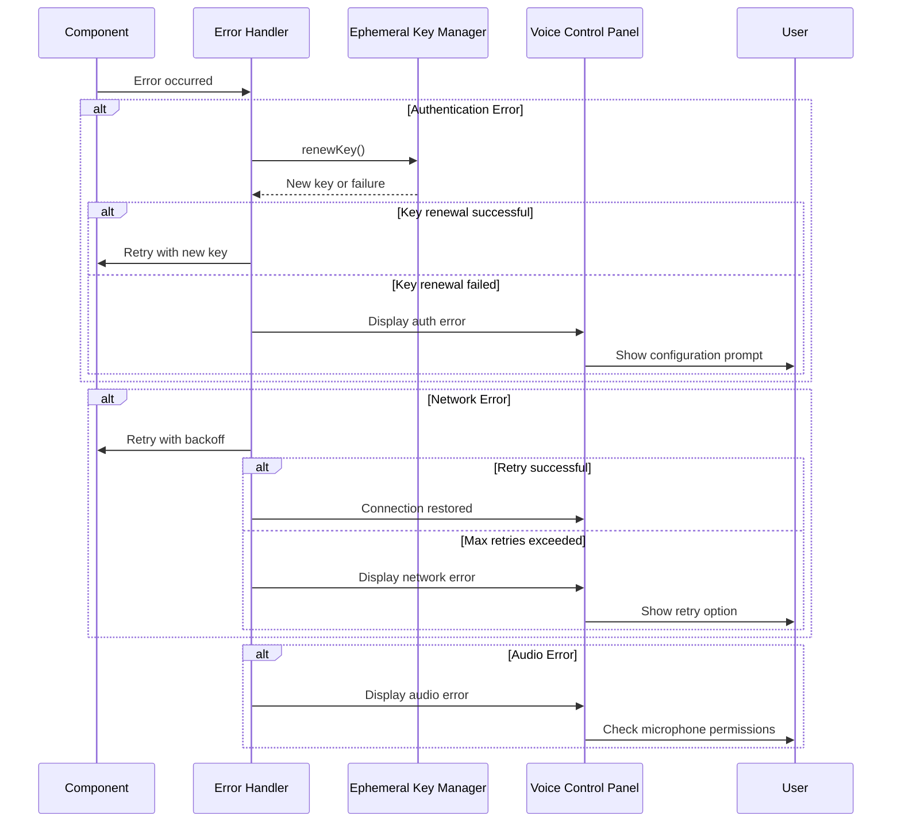
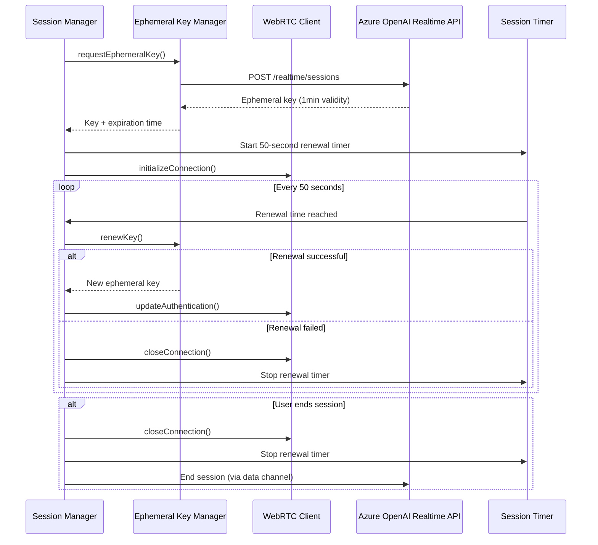
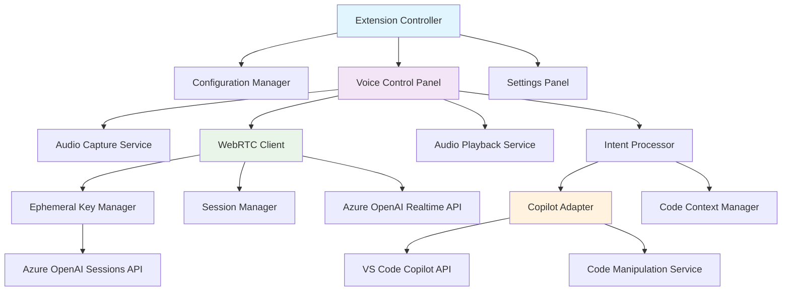

# Agent Voice Extension Components Design

## Overview

Agent Voice is a VS Code extension that enables hands/eyes free interaction with GitHub Copilot for specification writing, project planning, and task management using Azure OpenAI's GPT Realtime API via WebRTC. This document outlines the component architecture and interaction flows required for voice-driven planning sessions, document creation, and project ideation that leverages Copilot's existing system context and MCP server integrations.

## Architecture Principles

- **Node.js Audio Processing**: Audio capture and Azure integration run directly in the Node.js extension host using WebRTC native capabilities
- **Service-Based Architecture**: Dependency injection with `ServiceInitializable` lifecycle interface for all core services
- **WebRTC for Real-time Audio**: Low-latency audio streaming to Azure OpenAI Realtime API via WebRTC data channels
- **Ephemeral Key Authentication**: Short-lived keys (50-second rotation) for secure Azure OpenAI access
- **State Machine Coordination**: Conversation state machine orchestrates turn-taking, interruption, and Copilot integration
- **Modular Design**: Loosely coupled components with clear interfaces for maintainability and testability
- **Privacy-First**: Transcript privacy aggregation, purge capabilities, and policy enforcement

## Core Components

### 1. Audio Processing Layer (`src/audio/`)

#### 1.1 WebRTC Audio Service (`src/audio/webrtc-audio-service.ts`)

**Responsibilities:**

- Orchestrate WebRTC transport with extension services
- Manage audio session lifecycle and ephemeral key rotation
- Coordinate audio capture, processing, and playback
- Handle connection recovery and fallback strategies
- Emit telemetry and diagnostics

**Key Methods:**

- `initialize(): Promise<void>`
- `startSession(): Promise<void>`
- `endSession(): Promise<void>`
- `sendAudioData(data: ArrayBuffer): void`
- `onRealtimeEvent(handler: (event: RealtimeEvent) => void): Disposable`
- `dispose(): void`

**Dependencies:**

- `EphemeralKeyService` for authentication
- `SessionManager` for session state
- `WebRTCTransport` for connection management
- `AudioTrackManager` for stream handling

#### 1.2 WebRTC Transport (`src/audio/webrtc-transport.ts`)

**Responsibilities:**

- Manage WebRTC peer connection to Azure OpenAI Realtime API
- Handle SDP negotiation with ephemeral key authentication
- Process data channel for realtime events
- Monitor connection quality and emit diagnostics
- Implement connection recovery strategies

**Key Methods:**

- `connect(ephemeralKey: string): Promise<void>`
- `sendData(data: ArrayBuffer): void`
- `onDataChannelMessage(handler: (data: string) => void): void`
- `getConnectionStatistics(): ConnectionStatistics`
- `close(): void`

#### 1.3 Audio Processing Chain (`src/audio/audio-processing-chain.ts`)

**Responsibilities:**

- Capture microphone audio via Web Audio API in Node.js
- Apply audio processing (gain control, noise reduction)
- Convert audio formats (PCM16) for Azure OpenAI compatibility
- Manage AudioWorklet processors for real-time processing
- Handle jitter buffering for playback

**Key Methods:**

- `createAudioContext(): AudioContext`
- `processMicrophoneStream(stream: MediaStream): AudioWorkletNode`
- `convertToPCM16(audioBuffer: AudioBuffer): ArrayBuffer`
- `createPlaybackBuffer(): AudioBuffer`

#### 1.4 Audio Context Provider (`src/audio/audio-context-provider.ts`)

**Responsibilities:**

- Provide shared AudioContext instance across extension
- Manage AudioContext lifecycle and state
- Handle context suspension/resumption
- Configure audio context with extension settings

**Key Methods:**

- `getAudioContext(): AudioContext`
- `resume(): Promise<void>`
- `suspend(): Promise<void>`
- `dispose(): void`

### 2. Authentication & Session Management (`src/auth/`, `src/session/`)

#### 2.1 Ephemeral Key Service (`src/auth/ephemeral-key-service.ts`)

**Responsibilities:**

- Issue ephemeral keys from Azure OpenAI Realtime API
- Manage key lifecycle with 50-second rotation timer
- Handle automatic key renewal during active sessions
- Integrate with credential manager for secure key storage
- Emit telemetry for key lifecycle events

**Key Methods:**

- `initialize(): Promise<void>`
- `issueKey(): Promise<EphemeralKeyInfo>`
- `renewKey(): Promise<EphemeralKeyInfo>`
- `startRenewalTimer(callback: () => void): void`
- `stopRenewalTimer(): void`
- `dispose(): void`

**Security Pattern:**

```typescript
// Extension host only - uses DefaultAzureCredential or stored keys
class EphemeralKeyServiceImpl {
  private async issueKey(): Promise<EphemeralKeyInfo> {
    // Credential provider handles authentication (keyless or API key)
    const response = await axios.post(
      `${endpoint}/openai/realtime/sessions`,
      config,
      { headers: await this.getAuthHeaders() }
    );
    return {
      key: response.data.client_secret.value,
      expiresAt: response.data.client_secret.expires_at,
      sessionId: response.data.id
    };
  }
}
```

#### 2.2 Credential Manager (`src/auth/credential-manager.ts`)

**Responsibilities:**

- Manage Azure credentials (keyless via `DefaultAzureCredential` or API keys)
- Store credentials securely in VS Code secret storage
- Provide credential validation
- Generate authentication headers for Azure requests

**Key Methods:**

- `initialize(): Promise<void>`
- `getCredential(): Promise<AzureCredential>`
- `storeApiKey(key: string): Promise<void>`
- `validateCredential(): Promise<boolean>`
- `dispose(): void`

#### 2.3 Session Manager (`src/session/session-manager.ts`)

**Responsibilities:**

- Coordinate conversation session lifecycle
- Manage session state and configuration
- Track session metrics (duration, turn count)
- Handle session termination and cleanup
- Emit session lifecycle events

**Key Methods:**

- `initialize(): Promise<void>`
- `startSession(config: SessionConfig): Promise<SessionInfo>`
- `updateSession(sessionId: string, updates: Partial<SessionState>): void`
- `endSession(sessionId: string): Promise<void>`
- `getCurrentSession(): SessionInfo | undefined`
- `dispose(): void`

### 3. Conversation & Copilot Integration (`src/conversation/`, `src/copilot/`)

#### 3.1 Conversation State Machine (`src/conversation/conversation-state-machine.ts`)

**Responsibilities:**

- Orchestrate conversation lifecycle (idle → listening → processing → speaking)
- Coordinate turn-taking between user and assistant
- Handle interruption events and state transitions
- Emit state change events to subscribers
- Integrate with ChatIntegration for Copilot prompts

**Key Methods:**

- `start(): void`
- `processUserTurn(context: TurnContext): Promise<void>`
- `handleInterruption(): void`
- `stop(): void`
- `onStateChange(handler: (event: StateChangeEvent) => void): Disposable`
- `onTurnEvent(handler: (event: TurnEvent) => void): Disposable`

**State Transitions:**

```typescript
// State flow: idle → listening → processing → speaking → listening
enum ConversationState {
  Idle = 'idle',
  Listening = 'listening',
  Processing = 'processing',
  Speaking = 'speaking'
}
```

#### 3.2 Chat Integration (`src/copilot/chat-integration.ts`)

**Responsibilities:**

- Bridge conversation events to GitHub Copilot Chat APIs
- Send prompts to Copilot and receive responses
- Emit response lifecycle events (pending, streaming, completed, failed)
- Track request/response correlation
- Provide placeholder responses during API development

**Key Methods:**

- `sendPrompt(prompt: string, options?: CopilotPromptOptions): Promise<string>`
- `onResponse(handler: (event: CopilotResponseEvent) => void): Disposable`
- `dispose(): void`

**Integration Pattern:**

```typescript
class ChatIntegration {
  async sendPrompt(prompt: string): Promise<string> {
    this.responseEmitter.fire({ status: 'pending', requestId, timestamp });

    // Future: actual Copilot API integration
    // const response = await vscode.lm.sendRequest(...);

    // Current: placeholder response
    const response = `[Placeholder] Response to: ${prompt}`;

    this.responseEmitter.fire({
      status: 'completed',
      requestId,
      content: response
    });
    return response;
  }
}
```

#### 3.3 Transcript Privacy Aggregator (`src/conversation/transcript-privacy-aggregator.ts`)

**Responsibilities:**

- Aggregate conversation transcripts with privacy controls
- Track transcript retention policies
- Implement purge capabilities for sensitive data
- Provide anonymization and redaction
- Enforce privacy policy configuration

**Key Methods:**

- `addTranscriptEntry(entry: TranscriptEntry): void`
- `getTranscript(conversationId: string): TranscriptEntry[]`
- `purgeConversation(conversationId: string): void`
- `enforceRetentionPolicy(): void`
- `anonymizeTranscript(transcript: TranscriptEntry[]): TranscriptEntry[]`

### 4. Service Layer (`src/services/`)

#### 4.1 Realtime Speech-to-Text Service (`src/services/realtime-speech-to-text-service.ts`)

**Responsibilities:**

- Process realtime transcription events from Azure OpenAI
- Aggregate partial and final transcripts
- Emit transcript updates to subscribers
- Handle transcript confidence scoring
- Integrate with session manager for turn coordination

**Key Methods:**

- `initialize(): Promise<void>`
- `processRealtimeEvent(event: RealtimeEvent): void`
- `onTranscriptUpdate(handler: (transcript: string) => void): Disposable`
- `getCurrentTranscript(): string`
- `dispose(): void`

#### 4.2 Audio Feedback Service (`src/services/audio-feedback/audio-feedback-service.ts`)

**Responsibilities:**

- Play audio cues for session and state changes
- Manage accessibility profiles and ducking behavior
- Handle cue lifecycle (session start/end, thinking, error states)
- Implement degraded mode for playback failures
- Emit telemetry for cue latency and reliability

**Key Methods:**

- `initialize(): Promise<void>`
- `playSessionCue(type: 'start' | 'end'): Promise<void>`
- `playStateCue(state: ConversationState): Promise<void>`
- `playErrorCue(): Promise<void>`
- `setAccessibilityProfile(profile: AccessibilityProfile): void`
- `dispose(): void`

#### 4.3 Conversation Storage Service (`src/services/conversation/conversation-storage-service.ts`)

**Responsibilities:**

- Persist conversation history to workspace storage
- Load previous conversations on demand
- Implement retention policies
- Handle conversation metadata and indexing
- Provide search and retrieval capabilities

**Key Methods:**

- `saveConversation(conversation: Conversation): Promise<void>`
- `loadConversation(conversationId: string): Promise<Conversation>`
- `listConversations(): Promise<ConversationMetadata[]>`
- `deleteConversation(conversationId: string): Promise<void>`
- `enforceRetentionPolicy(): Promise<void>`

#### 4.4 Error Event Bus & Recovery (`src/services/error/`)

**Responsibilities:**

- Centralized error event distribution
- Coordinate recovery strategies across services
- Register and execute recovery plans
- Provide retry execution with exponential backoff
- Emit error telemetry and metrics

**Key Classes:**

- `ErrorEventBusImpl`: Publish/subscribe for error events
- `RecoveryOrchestrator`: Coordinate recovery across services
- `RecoveryRegistrationCenter`: Register recovery providers
- `RetryExecutorImpl`: Execute operations with retry logic
- `RetryMetricsLoggerSink`: Collect retry metrics

#### 4.5 Privacy Controller (`src/services/privacy/privacy-controller.ts`)

**Responsibilities:**

- Manage privacy policy enforcement
- Handle transcript purge commands
- Coordinate privacy controls across services
- Emit privacy-related telemetry

**Key Methods:**

- `initialize(): Promise<void>`
- `purgeConversation(conversationId: string): Promise<void>`
- `purgeAllConversations(): Promise<void>`
- `enforcePrivacyPolicy(): void`
- `dispose(): void`

### 5. UI Components (`src/ui/`)

#### 5.1 Voice Control Panel (`src/ui/voice-control-panel.ts`)

**Responsibilities:**

- Provide sidebar webview for voice conversation controls
- Display real-time transcription and conversation state
- Handle user actions (start/stop/pause conversation)
- Show session status, microphone state, and errors
- Integrate with audio feedback and configuration status

**Features:**

- Webview-based sidebar UI with message passing
- Real-time transcript display with speaker attribution
- Session status indicators (listening, thinking, speaking)
- Configuration requirement banner
- Copilot availability indicator
- Error banner with recovery actions
- Microphone status and permission handling

**State Management:**

```typescript
interface VoiceControlPanelState {
  status: PanelStatus;
  sessionId?: string;
  transcript: TranscriptEntry[];
  copilotAvailable: boolean;
  configurationComplete: boolean;
  microphoneStatus: MicrophoneStatus;
  errorBanner?: UserFacingError;
}
```

#### 5.2 Status Bar (`src/ui/status-bar.ts`)

**Responsibilities:**

- Display Agent Voice status in VS Code status bar
- Show connection state and session activity
- Provide quick access menu for conversation controls
- Indicate errors with visual feedback

**Features:**

- Status item with icon and text
- Click to open Voice Control Panel
- Right-click context menu (start/stop/pause, settings)
- Animated icon during active sessions
- Error indication with red background

#### 5.3 Error Presenter (`src/ui/error-presentation-adapter.ts`)

**Responsibilities:**

- Present errors to users in accessible format
- Provide contextual error messages and recovery actions
- Integrate with error event bus
- Show notifications with appropriate severity

**Key Methods:**

- `presentError(error: AgentVoiceError): void`
- `showRecoveryOptions(error: AgentVoiceError, plan: RecoveryPlan): void`
- `dismissError(errorId: string): void`

### 6. Core Extension Services (`src/core/`, `src/config/`)

#### 6.1 Extension Controller (`src/core/extension-controller.ts`)

**Responsibilities:**

- Coordinate Agent Voice service initialization and lifecycle
- Orchestrate dependency injection and service registration
- Manage cross-cutting concerns (recovery, telemetry, disposal)
- Implement configuration → auth → session → UI boot order
- Handle command registration and event wiring
- Coordinate error recovery and resource cleanup

**Key Methods:**

- `initialize(): Promise<void>`
- `startConversation(): Promise<void>`
- `endConversation(): Promise<void>`
- `handleServiceError(error: AgentVoiceError): void`
- `dispose(): void`

**Initialization Order:**

1. Configuration validation
2. Credential manager setup
3. Ephemeral key service initialization
4. Session manager startup
5. Audio services (WebRTC, feedback, STT)
6. UI components (panel, status bar)
7. Command registration

#### 6.2 Configuration Manager (`src/config/configuration-manager.ts`)

**Responsibilities:**

- Load and validate extension settings from VS Code workspace configuration
- Provide type-safe configuration access via section interfaces
- Handle configuration change events and notify subscribers
- Validate required settings (Azure endpoint, deployment)
- Cache configuration for performance

**Key Methods:**

- `initialize(): Promise<void>`
- `getAzureOpenAIConfig(): AzureOpenAIConfig`
- `getAzureRealtimeConfig(): AzureRealtimeConfig`
- `getAudioConfig(): AudioConfig`
- `getConversationConfig(): ConversationConfig`
- `isConfigured(): boolean`
- `revalidate(): Promise<ValidationResult>`
- `onChange(handler: ConfigurationChangeHandler): Disposable`

**Configuration Sections:**

- `AzureOpenAISection`: Endpoint, deployment, region, API version
- `AzureRealtimeSection`: Model, transcription, audio formats
- `AudioSection`: Devices, sample rate, noise reduction
- `AudioFeedbackSection`: Cues, volumes, accessibility profiles
- `ConversationSection`: Turn-taking policies, interruption settings
- `PrivacyPolicySection`: Retention, purge policies

#### 6.3 Logger (`src/core/logger.ts`)

**Responsibilities:**

- Provide structured logging with severity levels
- Integrate with VS Code output channels
- Support context-scoped loggers
- Sanitize sensitive data from logs

**Key Methods:**

- `info(message: string, metadata?: object): void`
- `warn(message: string, metadata?: object): void`
- `error(message: string, error?: Error): void`
- `debug(message: string, metadata?: object): void`

#### 6.4 Disposal Orchestrator (`src/core/disposal/`)

**Responsibilities:**

- Coordinate service disposal in priority order
- Track disposable resources and detect orphans
- Handle fatal error cleanup
- Provide scoped disposable patterns

**Key Classes:**

- `DisposalOrchestratorImpl`: Priority-based disposal coordination
- `OrphanDetector`: Detect and report leaked resources
- `OrphanResourceTracker`: Track resource lifecycle
- `ScopedDisposable`: Wrap services with disposal priority

## Sequence Diagrams

### 1. Extension Initialization Sequence



### 2. Voice Session and Processing Sequence



### 3. Conversation State and Copilot Integration



### 4. Error Handling and Recovery Sequence



### 5. Session Lifecycle Management



## Component Dependencies



## Configuration Requirements

### Azure OpenAI Settings

- `agentvoice.azureOpenAI.endpoint`: Azure OpenAI resource endpoint (required)
- `agentvoice.azureOpenAI.deploymentName`: Realtime model deployment name (required)
- `agentvoice.azureOpenAI.region`: Azure region (eastus2 or swedencentral)
- `agentvoice.azureOpenAI.apiVersion`: API version for REST calls (default: 2025-04-01-preview)
- **Authentication**: Keyless via `DefaultAzureCredential` or API key in VS Code secret storage

### Azure Realtime Settings

- `agentvoice.azureRealtime.model`: Model identifier (default: gpt-realtime)
- `agentvoice.azureRealtime.apiVersion`: Realtime API version (default: 2025-08-28)
- `agentvoice.azureRealtime.transcriptionModel`: Transcription model (default: whisper-1)
- `agentvoice.azureRealtime.inputAudioFormat`: Input PCM format (pcm16/pcm24/pcm32)
- `agentvoice.azureRealtime.locale`: Locale hint for transcription (default: en-US)
- `agentvoice.azureRealtime.profanityFilter`: Filter level (none/medium/high)

### Audio Settings

- `agentvoice.audio.inputDevice`: Preferred microphone device (default: default)
- `agentvoice.audio.outputDevice`: Preferred speaker device (default: default)
- `agentvoice.audio.noiseReduction`: Enable noise reduction (default: true)
- `agentvoice.audio.echoCancellation`: Enable echo cancellation (default: true)
- `agentvoice.audio.sampleRate`: Audio sample rate Hz (default: 24000)
- `agentvoice.audio.context.autoResume`: Auto-resume AudioContext (default: true)
- `agentvoice.audio.context.latencyHint`: Latency optimization (interactive/balanced/playback)

### Turn Detection Settings

- `agentvoice.audio.turnDetection.type`: Detection strategy (server_vad/semantic_vad/none)
- `agentvoice.audio.turnDetection.threshold`: VAD threshold 0.0-1.0 (default: 0.5)
- `agentvoice.audio.turnDetection.prefixPaddingMs`: Audio before speech start (default: 300ms)
- `agentvoice.audio.turnDetection.silenceDurationMs`: Silence for turn end (default: 200ms)
- `agentvoice.audio.turnDetection.createResponse`: Auto-trigger response (default: true)
- `agentvoice.audio.turnDetection.interruptResponse`: Allow interruptions (default: true)

### Audio Feedback Settings

- `agentvoice.audioFeedback.enabled`: Enable audio cues (default: true)
- `agentvoice.audioFeedback.accessibilityProfile`: Profile (standard/high-contrast/silent)
- `agentvoice.audioFeedback.defaultDucking`: Ducking behavior (none/attenuate/pause/crossfade)
- `agentvoice.audioFeedback.volume.*`: Volume multipliers for cue categories

### Conversation Settings

- `agentvoice.conversation.policyProfile`: Turn-taking policy (default/assertive/hands-free/custom)
- `agentvoice.conversation.interruptionBudgetMs`: Interruption latency budget (default: 250ms)
- `agentvoice.conversation.allowBargeIn`: Allow user interruptions (default: true)
- `agentvoice.conversation.fallbackMode`: Fallback strategy (manual/hybrid)

## Security Considerations

1. **Credential Protection**: Support keyless authentication via `DefaultAzureCredential` or store API keys in VS Code secret storage
2. **Ephemeral Key Rotation**: 50-second rotation cycle for time-limited Azure session keys
3. **Audio Privacy**: Audio data only sent to configured Azure OpenAI endpoints via secure WebRTC
4. **Transcript Privacy**: Privacy controller enforces retention policies and supports purge operations
5. **Permission Management**: Graceful microphone permission handling with user guidance
6. **Error Sanitization**: Redact sensitive data from logs and error messages via sanitization helpers
7. **Configuration Validation**: Validate Azure endpoints and deployment names before connection
8. **Resource Cleanup**: Disposal orchestrator ensures proper cleanup to prevent leaks

## Performance Optimization

1. **Audio Buffering**: Efficient jitter buffering and AudioWorklet processing for low latency
2. **Connection Recovery**: Automatic reconnection with exponential backoff and WebSocket fallback
3. **Lazy Initialization**: Services initialize on-demand via `ServiceInitializable` interface
4. **Memory Management**: Disposal orchestrator ensures proper cleanup of audio streams, connections, and timers
5. **Configuration Caching**: ConfigurationManager caches settings with debounced change propagation
6. **Shared AudioContext**: Single AudioContext instance shared across extension via provider pattern
7. **Orphan Detection**: Track and report resource leaks during development and testing

## Testing Strategy

1. **Unit Tests**: Test individual components in isolation
2. **Integration Tests**: Test component interactions and API calls
3. **Audio Tests**: Test with various microphone setups and audio conditions
4. **Network Tests**: Test with different network conditions and failures
5. **User Acceptance Tests**: Test complete voice command workflows

## Current Implementation Status

### ✅ Phase 1: Core Audio Pipeline (Completed)

1. ✅ WebRTC Transport with Azure OpenAI Realtime API
2. ✅ Audio Capture and Processing Chain
3. ✅ Ephemeral Key Service with 50-second rotation
4. ✅ Credential Manager (keyless + API key support)
5. ✅ WebRTC Audio Service orchestration
6. ✅ Turn detection coordination (server VAD, semantic VAD)
7. ✅ Audio feedback system with accessibility profiles

### ✅ Phase 2: Session & Conversation Management (Completed)

1. ✅ Session Manager with lifecycle tracking
2. ✅ Conversation State Machine with turn-taking
3. ✅ Interruption Engine for barge-in support
4. ✅ Realtime Speech-to-Text Service
5. ✅ Transcript Privacy Aggregator
6. ✅ Conversation Storage Service

### ✅ Phase 3: UI & Error Handling (Completed)

1. ✅ Voice Control Panel (sidebar webview)
2. ✅ Status Bar integration
3. ✅ Error Event Bus and Recovery Orchestrator
4. ✅ Error Presenter for user-facing errors
5. ✅ Configuration Manager with validation
6. ✅ Disposal Orchestrator with orphan detection
7. ✅ Retry execution with exponential backoff

### 🔄 Phase 4: Copilot Integration (In Progress)

1. ✅ Chat Integration placeholder
2. ✅ Prompt Handler infrastructure
3. 🔄 VS Code Language Model API integration (pending finalization)
4. 📋 Intent processor for voice commands
5. 📋 Context manager for codebase awareness

### 📋 Phase 5: Enhanced Features (Planned)

1. 📋 Advanced voice command patterns
2. 📋 Multi-modal interaction (voice + text + code)
3. 📋 Extended telemetry and analytics
4. 📋 Performance profiling and optimization
5. 📋 Accessibility enhancements

This component architecture provides a robust foundation for the Agent Voice extension with proper separation of concerns, secure authentication, efficient real-time audio processing, and comprehensive error handling.
