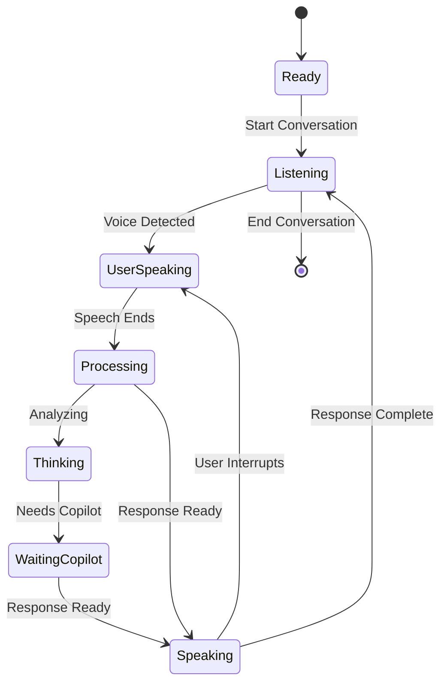

# Agent Voice Extension UI Design

## Overview

Agent Voice provides a natural, conversational voice interface for hands/eyes free project planning, specification writing, and task management. The focus is on seamless two-way conversation where users can interrupt Agent Voice at any time, with minimal visual controls and gentle audio/visual feedback during processing states. This design serves both accessibility needs (visual impairments, conditions like Bell's Palsy) and enables fluid conversational workflows in situations where traditional keyboard/screen interaction isn't practical (e.g., commuting, walking, or during ideation sessions).

## Design Principles

- **Natural Conversation Flow**: Continuous dialogue with interruption support
- **Minimal Visual Interface**: Clean, distraction-free design
- **Audio-First Experience**: Primary interaction through voice with subtle visual cues
- **Seamless Integration**: Works naturally with existing VS Code and Copilot workflows

## 1. Primary Sidebar Integration

### 1.1 Activity Bar Icon

**Location**: VS Code Activity Bar (left sidebar)
**Icon States**:

- **Inactive**: Subtle microphone icon
- **Conversation Active**: Gentle pulsing animation
- **User Speaking**: Soft blue glow
- **Agent Voice Speaking**: Soft green glow
- **Thinking/Waiting**: Gentle orange pulse

```
Position: After Explorer, Search, Source Control, Run and Debug
Icon: 🎤 (clean microphone with minimal visual feedback)
Tooltip: "Agent Voice - Start Conversation"
```

### 1.2 Agent Voice Panel

**Layout**: Full-height sidebar panel (similar to Explorer or Extensions)

#### Panel Header

```
┌─────────────────────────────────────┐
│ 🎤 Agent Voice                    ⚙️  │
├─────────────────────────────────────┤
│ ● Conversation Active               │
└─────────────────────────────────────┘
```

**Header Elements**:

- **Title**: "Agent Voice" with status indicator
- **Settings**: Single gear icon for configuration
- **Status**: Simple text indicator ("Ready", "Listening", "Speaking", "Thinking")
- **No Volume Meters**: Audio-first approach without visual distractions

#### Main Conversation Area

**Design Pattern**: Clean conversational flow with minimal visual elements

```text
┌─────────────────────────────────────┐
│                                     │
│ "I need to plan a new user          │
│ authentication feature"             │
│                                     │
│ I'll help you plan the auth         │
│ feature. Let me analyze your        │
│ current system first...             │
│                                     │
│ ✓ System context analyzed           │
│                                     │
│ "What security requirements should  │
│ we consider?"                       │
│                                     │
│ ⋯ (gentle thinking animation)       │
│                                     │
│ Based on your existing system,      │
│ here are key security               │
│ considerations...                   │
│                                     │
│ ✓ Requirements document created     │
│                                     │
└─────────────────────────────────────┘
```

#### Footer Controls

```
┌─────────────────────────────────────┐
│                                     │
│        [Start Conversation]         │
│              or                     │
│         [End Conversation]          │
│                                     │
└─────────────────────────────────────┘
```

**Controls**:

- **Single Action Button**: "Start Conversation" or "End Conversation"
- **Voice Activation**: Always listening once conversation starts
- **Natural Interruption**: User can speak anytime to interrupt Agent Voice
- **Silence Detection**: Automatic turn-taking based on speech pauses

## 2. Conversation Flow States

### 2.1 Initial State (Ready to Start)

```text
┌─────────────────────────────────────┐
│ 🎤 Agent Voice                    ⚙️  │
├─────────────────────────────────────┤
│                                     │
│    Hands/Eyes Free Planning         │
│                                     │
│    Start a natural conversation     │
│    about your project               │
│                                     │
│       [Start Conversation]          │
│                                     │
│  Discuss requirements, plan         │
│  features, create specifications,   │
│  or break down tasks                │
│                                     │
└─────────────────────────────────────┘
```

### 2.2 Active Conversation State

```text
┌─────────────────────────────────────┐
│ 🎤 Agent Voice                    ⚙️  │
├─────────────────────────────────────┤
│ ● Listening                         │
├─────────────────────────────────────┤
│                                     │
│ "I need to plan a new user          │
│ authentication feature"             │
│                                     │
│ ⋯ Analyzing system context...       │
│                                     │
│        [End Conversation]           │
│                                     │
└─────────────────────────────────────┘
```

### 2.3 Thinking/Waiting States

#### Agent Voice Thinking

```text
┌─────────────────────────────────────┐
│ 🎤 Agent Voice                    ⚙️  │
├─────────────────────────────────────┤
│ ⋯ Thinking                          │
├─────────────────────────────────────┤
│                                     │
│ "I need to plan a new user          │
│ authentication feature"             │
│                                     │
│ ⋯ (gentle pulsing animation)        │
│   (soft thinking audio plays)       │
│                                     │
└─────────────────────────────────────┘
```

#### Waiting for Copilot

```text
┌─────────────────────────────────────┐
│ 🎤 Agent Voice                    ⚙️  │
├─────────────────────────────────────┤
│ ⋯ Waiting for Copilot               │
├─────────────────────────────────────┤
│                                     │
│ "How should we structure the user   │
│ database schema?"                   │
│                                     │
│ ⋯ Waiting for Copilot...            │
│   (gentle thinking audio)           │
│   (orange pulse indicator)          │
│                                     │
└─────────────────────────────────────┘

### Behavior when GitHub Copilot Chat is not installed

- **Degraded state:** If the `GitHub Copilot Chat` extension is not installed, Agent Voice continues to operate for local voice interactions (transcription, local planning, and simple voice-driven features) but will not be able to forward prompts or request Copilot-generated responses.
- **UI indication:** The panel shows a clear status line `⋯ Waiting for Copilot (not installed)` and an orange warning badge on the header while Copilot-specific actions are attempted.
- **User prompt:** When a Copilot action is required (for example, "Ask Copilot to generate code"), Agent Voice will prompt the user with a one-click install option: `Install Copilot Chat`. Choosing this action triggers the Marketplace installation flow and then prompts the user to reload VS Code.
- **Context key:** The extension sets a context key `agentvoice.copilotAvailable` (true/false) so commands and UI elements requiring Copilot can be hidden or disabled via `when` clauses.
- **Graceful fallback:** If the user declines installation or installation fails, Agent Voice offers an in-place fallback message explaining which features are unavailable and provides manual instructions (Marketplace link and VSIX advice) in the settings/help pane.

```

#### Agent Voice Speaking

```text
┌─────────────────────────────────────┐
│ 🎤 Agent Voice                    ⚙️  │
├─────────────────────────────────────┤
│ ● Speaking                          │
├─────────────────────────────────────┤
│                                     │
│ "I need to plan a new user          │
│ authentication feature"             │
│                                     │
│ I'll help you plan the auth         │
│ feature. Based on your existing...  │
│   (text appears as spoken)          │
│   (user can interrupt by speaking)  │
│                                     │
└─────────────────────────────────────┘
```

## 3. Audio Feedback System

### 3.1 Thinking Audio

**Purpose**: Gentle audio cue when Agent Voice is processing

- **Sound**: Soft, ambient thinking tone (similar to a gentle "hmm")
- **Duration**: 1-2 second loop, fades in/out smoothly
- **Volume**: 20% of system volume, non-intrusive
- **Trigger**: When waiting for response generation or Copilot

### 3.2 Interruption Handling

**User Speech Detection**:

- **Immediate Response**: Agent Voice stops speaking when user starts
- **Audio Fade**: Current audio fades out quickly (200ms)
- **Visual Transition**: Status changes to "● Listening"
- **Context Preservation**: Maintains conversation context

### 3.3 Turn-Taking Audio Cues

**Silence Detection**:

- **User Pause**: 1.5 seconds of silence triggers Agent Voice response
- **Conversation Flow**: Natural back-and-forth without button presses
- **Audio Confirmation**: Subtle tone when switching speakers

## 4. Natural Conversation Features

### 4.1 Voice Activity Detection (VAD)

- **Always Listening**: Once conversation starts, continuously monitors for user speech
- **Interruption Support**: User can speak anytime to interrupt Agent Voice
- **Noise Filtering**: Distinguishes speech from background noise
- **Sensitivity Settings**: Adjustable detection threshold

### 4.2 Continuous Dialogue Flow



### 4.3 Interruption Patterns

- **Clean Interruption**: Agent Voice stops immediately when user speaks
- **Context Retention**: Remembers where it was interrupted
- **Resume Capability**: Can continue previous thought if relevant
- **Graceful Transitions**: Smooth audio crossfades

## 5. Integration with Copilot Chat

### 5.1 Seamless Integration

- **Unified Experience**: Agent Voice conversations appear in Copilot Chat panel
- **Voice Annotations**: Messages include speaker indicators (👤 User, 🎤 Voice)
- **Mixed Interaction**: Users can switch between voice and text seamlessly
- **Context Sharing**: Voice conversations contribute to Copilot's context
- **System Context**: Leverages Copilot's existing codebase and design document awareness
- **MCP Server Access**: Utilizes Copilot's MCP server integrations for enhanced planning capabilities

### 5.2 Planning Response Formatting

````text
👤 User (voice): "How should we approach user authentication for our new mobile app?"

🤖 Copilot: Let me help you plan the authentication strategy. Based on your existing system architecture, here are some considerations:

**Authentication Options:**
1. OAuth 2.0 with PKCE for mobile apps
2. JWT tokens with refresh token rotation
3. Biometric authentication integration

**Security Requirements:**
- Multi-factor authentication support
- Session management and timeout
- Secure token storage on mobile devices

Would you like me to create a detailed specification document for any of these approaches?
````

## 6. Accessibility and Responsive Design

### 6.1 Accessibility Features
- **Keyboard Navigation**: All functions accessible via keyboard shortcuts
- **Screen Reader Support**: ARIA labels for voice status and controls
- **Visual Indicators**: High contrast status indicators for deaf/hard-of-hearing users
- **Customizable UI**: Adjustable text size, colors, and audio feedback levels

### 6.2 Voice-First Design Principles
- **Minimal Visual Dependency**: Core functionality works entirely through voice
- **Audio Redundancy**: Important visual states have audio equivalents
- **Natural Language**: All interactions use conversational patterns
- **Error Recovery**: Voice-guided error correction and retry mechanisms

### 6.3 Responsive Layout
- **Sidebar Integration**: Fits naturally in VS Code's sidebar panel system
- **Collapsible Sections**: Conversation history and settings can be minimized
- **Mobile-Ready**: Design principles work for VS Code mobile experiences
- **Split Screen**: Works alongside code editor and other panels

## 7. Technical Implementation Notes

### 7.1 Audio Technology Stack
- **WebRTC**: Low-latency audio streaming with Azure OpenAI Realtime API
- **VAD Engine**: Client-side voice activity detection for interruption
- **Audio Processing**: Real-time noise reduction and echo cancellation
- **Format Support**: Multiple audio codecs for optimal quality

### 7.2 Performance Considerations
- **Lazy Loading**: Audio engines initialize only when needed
- **Background Processing**: Voice detection runs efficiently in background
- **Memory Management**: Audio buffers cleaned up after conversations
- **Network Optimization**: Compressed audio streams, connection pooling

### 7.3 Security and Privacy
- **Ephemeral Keys**: 50-second Azure OpenAI key rotation
- **Local Processing**: VAD and audio preprocessing happen client-side
- **No Audio Storage**: Conversations are not recorded or stored
- **User Control**: Clear start/stop conversation boundaries

---

## Implementation Priority

### Phase 1: Core Conversational Interface ✅
- Basic panel layout with minimal controls
- Natural conversation states (Ready → Listening → Speaking)
- Simple audio feedback system

### Phase 2: Advanced Voice Features 🔄
- Interruption handling and turn-taking
- Thinking audio and visual cues
- Continuous dialogue flow

### Phase 3: Copilot Integration 📋
- Seamless chat panel integration
- Mixed voice/text interaction
- Context sharing and response formatting

### Phase 4: Polish and Accessibility 📋
- Full accessibility compliance
- Advanced audio processing
- Performance optimization and security hardening

This UI design creates a natural, conversational voice interface that feels like talking to an intelligent assistant rather than operating a traditional software tool.
```
