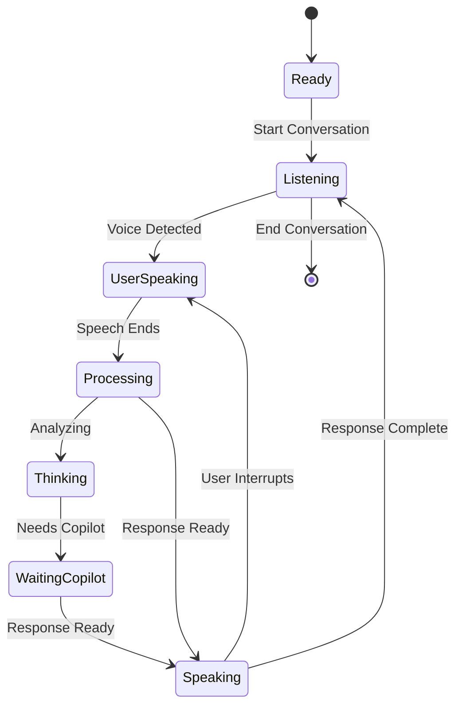

# VoicePilot Extension UI Design

## Overview

VoicePilot provides a natural, conversational voice interface similar to Microsoft Copilot's realtime chat mode. The focus is on seamless two-way conversation where users can interrupt VoicePilot at any time, with minimal visual controls and gentle audio/visual feedback during processing states.

## Design Principles

- **Natural Conversation Flow**: Continuous dialogue with interruption support
- **Minimal Visual Interface**: Clean, distraction-free design
- **Audio-First Experience**: Primary interaction through voice with subtle visual cues
- **Seamless Integration**: Works naturally with existing VS Code and Copilot workflows

## 1. Primary Sidebar Integration

### 1.1 Activity Bar Icon

**Location**: VS Code Activity Bar (left sidebar)
**Icon States**:

- **Inactive**: Subtle microphone icon
- **Conversation Active**: Gentle pulsing animation
- **User Speaking**: Soft blue glow
- **VoicePilot Speaking**: Soft green glow
- **Thinking/Waiting**: Gentle orange pulse

```
Position: After Explorer, Search, Source Control, Run and Debug
Icon: 🎤 (clean microphone with minimal visual feedback)
Tooltip: "VoicePilot - Start Conversation"
```

### 1.2 VoicePilot Panel

**Layout**: Full-height sidebar panel (similar to Explorer or Extensions)

#### Panel Header

```
┌─────────────────────────────────────┐
│ 🎤 VoicePilot                    ⚙️  │
├─────────────────────────────────────┤
│ ● Conversation Active               │
└─────────────────────────────────────┘
```

**Header Elements**:

- **Title**: "VoicePilot" with status indicator
- **Settings**: Single gear icon for configuration
- **Status**: Simple text indicator ("Ready", "Listening", "Speaking", "Thinking")
- **No Volume Meters**: Audio-first approach without visual distractions

#### Main Conversation Area

**Design Pattern**: Clean conversational flow with minimal visual elements

```
┌─────────────────────────────────────┐
│                                     │
│ "Create a function that calculates  │
│ the factorial of a number"          │
│                                     │
│ I'll create a factorial function    │
│ for you in TypeScript.              │
│                                     │
│ ✓ Function added to current file    │
│                                     │
│ "Add error handling for negative    │
│ numbers"                            │
│                                     │
│ ⋯ (gentle thinking animation)       │
│                                     │
│ Good idea! I'll add input           │
│ validation to handle negative       │
│ numbers and throw an error.         │
│                                     │
│ ✓ Error handling added              │
│                                     │
└─────────────────────────────────────┘
```

#### Footer Controls

```
┌─────────────────────────────────────┐
│                                     │
│        [Start Conversation]         │
│              or                     │
│         [End Conversation]          │
│                                     │
└─────────────────────────────────────┘
```

**Controls**:

- **Single Action Button**: "Start Conversation" or "End Conversation"
- **Voice Activation**: Always listening once conversation starts
- **Natural Interruption**: User can speak anytime to interrupt VoicePilot
- **Silence Detection**: Automatic turn-taking based on speech pauses

## 2. Conversation Flow States

### 2.1 Initial State (Ready to Start)

```
┌─────────────────────────────────────┐
│ 🎤 VoicePilot                    ⚙️  │
├─────────────────────────────────────┤
│                                     │
│      Voice Coding Assistant         │
│                                     │
│    Start a natural conversation     │
│    about your code                  │
│                                     │
│       [Start Conversation]          │
│                                     │
│  Just speak naturally - ask         │
│  questions, request changes,        │
│  or get explanations                │
│                                     │
└─────────────────────────────────────┘
```

### 2.2 Active Conversation State

```
┌─────────────────────────────────────┐
│ 🎤 VoicePilot                    ⚙️  │
├─────────────────────────────────────┤
│ ● Listening                         │
├─────────────────────────────────────┤
│                                     │
│ "Create a function that calculates  │
│ the factorial of a number"          │
│                                     │
│ ⋯ Thinking...                       │
│                                     │
│        [End Conversation]           │
│                                     │
└─────────────────────────────────────┘
```

### 2.3 Thinking/Waiting States

#### VoicePilot Thinking

```
┌─────────────────────────────────────┐
│ 🎤 VoicePilot                    ⚙️  │
├─────────────────────────────────────┤
│ ⋯ Thinking                          │
├─────────────────────────────────────┤
│                                     │
│ "Create a function that calculates  │
│ the factorial of a number"          │
│                                     │
│ ⋯ (gentle pulsing animation)        │
│   (soft thinking audio plays)       │
│                                     │
└─────────────────────────────────────┘
```

#### Waiting for Copilot

```
┌─────────────────────────────────────┐
│ 🎤 VoicePilot                    ⚙️  │
├─────────────────────────────────────┤
│ ⋯ Waiting for Copilot               │
├─────────────────────────────────────┤
│                                     │
│ "Explain this complex algorithm"    │
│                                     │
│ ⋯ Waiting for Copilot...            │
│   (gentle thinking audio)           │
│   (orange pulse indicator)          │
│                                     │
└─────────────────────────────────────┘
```

#### VoicePilot Speaking

```
┌─────────────────────────────────────┐
│ 🎤 VoicePilot                    ⚙️  │
├─────────────────────────────────────┤
│ ● Speaking                          │
├─────────────────────────────────────┤
│                                     │
│ "Create a function that calculates  │
│ the factorial of a number"          │
│                                     │
│ I'll create a factorial function    │
│ for you. This function will...      │
│   (text appears as spoken)          │
│   (user can interrupt by speaking)  │
│                                     │
└─────────────────────────────────────┘
```

## 3. Audio Feedback System

### 3.1 Thinking Audio

**Purpose**: Gentle audio cue when VoicePilot is processing

- **Sound**: Soft, ambient thinking tone (similar to a gentle "hmm")
- **Duration**: 1-2 second loop, fades in/out smoothly
- **Volume**: 20% of system volume, non-intrusive
- **Trigger**: When waiting for response generation or Copilot

### 3.2 Interruption Handling

**User Speech Detection**:

- **Immediate Response**: VoicePilot stops speaking when user starts
- **Audio Fade**: Current audio fades out quickly (200ms)
- **Visual Transition**: Status changes to "● Listening"
- **Context Preservation**: Maintains conversation context

### 3.3 Turn-Taking Audio Cues

**Silence Detection**:

- **User Pause**: 1.5 seconds of silence triggers VoicePilot response
- **Conversation Flow**: Natural back-and-forth without button presses
- **Audio Confirmation**: Subtle tone when switching speakers

## 4. Natural Conversation Features

### 4.1 Voice Activity Detection (VAD)

- **Always Listening**: Once conversation starts, continuously monitors for user speech
- **Interruption Support**: User can speak anytime to interrupt VoicePilot
- **Noise Filtering**: Distinguishes speech from background noise
- **Sensitivity Settings**: Adjustable detection threshold

### 4.2 Continuous Dialogue Flow



### 4.3 Interruption Patterns

- **Clean Interruption**: VoicePilot stops immediately when user speaks
- **Context Retention**: Remembers where it was interrupted
- **Resume Capability**: Can continue previous thought if relevant
- **Graceful Transitions**: Smooth audio crossfades

## 5. Integration with Copilot Chat

### 5.1 Seamless Integration

- **Unified Experience**: VoicePilot conversations appear in Copilot Chat panel
- **Voice Annotations**: Messages include speaker indicators (👤 User, 🎤 Voice)
- **Mixed Interaction**: Users can switch between voice and text seamlessly
- **Context Sharing**: Voice conversations contribute to Copilot's context

### 5.2 Response Formatting

````
👤 User (voice): "How do I create a new React component?"

🤖 Copilot: Let me help you create a React component. Here's a functional component pattern:

```tsx
import React from 'react';

interface MyComponentProps {
  title: string;
}

const MyComponent: React.FC<MyComponentProps> = ({ title }) => {
  return (
    <div>
      <h2>{title}</h2>
    </div>
  );
};

export default MyComponent;
````

Would you like me to explain any part of this component structure?

```

## 6. Accessibility and Responsive Design

### 6.1 Accessibility Features
- **Keyboard Navigation**: All functions accessible via keyboard shortcuts
- **Screen Reader Support**: ARIA labels for voice status and controls
- **Visual Indicators**: High contrast status indicators for deaf/hard-of-hearing users
- **Customizable UI**: Adjustable text size, colors, and audio feedback levels

### 6.2 Voice-First Design Principles
- **Minimal Visual Dependency**: Core functionality works entirely through voice
- **Audio Redundancy**: Important visual states have audio equivalents
- **Natural Language**: All interactions use conversational patterns
- **Error Recovery**: Voice-guided error correction and retry mechanisms

### 6.3 Responsive Layout
- **Sidebar Integration**: Fits naturally in VS Code's sidebar panel system
- **Collapsible Sections**: Conversation history and settings can be minimized
- **Mobile-Ready**: Design principles work for VS Code mobile experiences
- **Split Screen**: Works alongside code editor and other panels

## 7. Technical Implementation Notes

### 7.1 Audio Technology Stack
- **WebRTC**: Low-latency audio streaming with Azure OpenAI Realtime API
- **VAD Engine**: Client-side voice activity detection for interruption
- **Audio Processing**: Real-time noise reduction and echo cancellation
- **Format Support**: Multiple audio codecs for optimal quality

### 7.2 Performance Considerations
- **Lazy Loading**: Audio engines initialize only when needed
- **Background Processing**: Voice detection runs efficiently in background
- **Memory Management**: Audio buffers cleaned up after conversations
- **Network Optimization**: Compressed audio streams, connection pooling

### 7.3 Security and Privacy
- **Ephemeral Keys**: 50-second Azure OpenAI key rotation
- **Local Processing**: VAD and audio preprocessing happen client-side
- **No Audio Storage**: Conversations are not recorded or stored
- **User Control**: Clear start/stop conversation boundaries

---

## Implementation Priority

### Phase 1: Core Conversational Interface ✅
- Basic panel layout with minimal controls
- Natural conversation states (Ready → Listening → Speaking)
- Simple audio feedback system

### Phase 2: Advanced Voice Features 🔄
- Interruption handling and turn-taking
- Thinking audio and visual cues
- Continuous dialogue flow

### Phase 3: Copilot Integration 📋
- Seamless chat panel integration
- Mixed voice/text interaction
- Context sharing and response formatting

### Phase 4: Polish and Accessibility 📋
- Full accessibility compliance
- Advanced audio processing
- Performance optimization and security hardening

This UI design creates a natural, conversational voice interface that feels like talking to an intelligent assistant rather than operating a traditional software tool.
```
