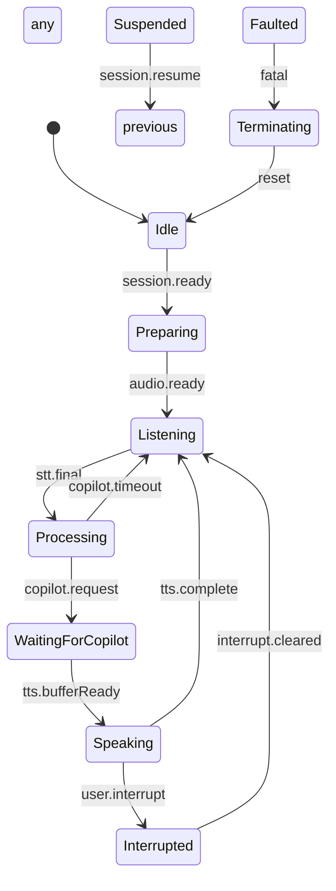

## Introduction

This specification defines the conversation state machine governing Agent Voice's full-duplex voice interactions. The state machine orchestrates transitions between listening, thinking, speaking, and interruption flows while coordinating with session management, realtime speech-to-text (STT), and text-to-speech (TTS) services. It provides deterministic behavioural contracts for the extension host, webview audio pipeline, and GitHub Copilot integrations so that users experience natural, low-latency conversations consistent with the UI design guidelines.

## 1. Purpose & Scope

The purpose of this specification is to standardize the conversation lifecycle that connects Azure OpenAI realtime events, Agent Voice audio services, and VS Code UI components. Scope includes:

- Formal state and transition definitions for user/assistant turns, background processing, and error recovery.
- Integration rules between Session Manager (SP-005), Realtime STT (SP-009), TTS Output (SP-010), and UI surfaces (`docs/design/UI.md`).
- Message contracts for state change notifications and action triggers across the extension host and webview contexts.
- Timing guarantees, interruption handling, and fallback behaviours required for accessibility and resilience.

**Intended Audience**: Extension and webview engineers, conversation designers, QA automation engineers, and Azure OpenAI integration specialists.

**Assumptions**:

- Session Manager (SP-005) provides active session IDs, key renewal signals, and heartbeat telemetry.
- STT (SP-009) emits transcript and VAD events with ≤250 ms latency.
- TTS (SP-010) streams audio using PCM16 buffers and exposes speaking state events.
- UI panel states follow `docs/design/UI.md` semantics for Ready, Listening, Thinking, Waiting for Copilot, and Speaking.
- Azure OpenAI realtime session is configured with `modalities: ['text','audio']`, turn detection, and duplex capabilities.

## 2. Definitions

- **Conversation State Machine (CSM)**: Deterministic controller that governs Agent Voice conversational states.
- **Turn**: Single exchange where either the user or Agent Voice speaks while the other listens.
- **Idle**: Baseline ready state after initialization with no active audio streams.
- **Listening**: State where the system captures user audio and routes it to STT.
- **Processing**: State where incoming transcripts are being analysed or forwarded to Copilot.
- **WaitingForCopilot**: Sub-state of Processing where Agent Voice awaits Copilot or LLM completion.
- **Speaking**: State where TTS is streaming audio to the user.
- **Interrupted**: Transitional state invoked when the user speaks while Agent Voice is still talking.
- **Suspended**: Temporary pause due to session renewal, network reconnection, or diagnostics.
- **Faulted**: Error state entered when unrecoverable failures occur.
- **State Transition Event**: Structured notification describing movement between conversation states.
- **Turn Context**: Aggregated metadata (timestamps, transcript IDs, Copilot request IDs) for the current turn.

## 3. Requirements, Constraints & Guidelines

### State & Transition Requirements

- **REQ-001**: The CSM SHALL implement the following primary states: `Idle`, `Preparing`, `Listening`, `Processing`, `WaitingForCopilot`, `Speaking`, `Interrupted`, `Suspended`, `Faulted`, and `Terminating`.
- **REQ-002**: The CSM SHALL transition from `Idle` to `Preparing` only after Session Manager reports an active session and audio pipelines are primed.
- **REQ-003**: Entry into `Listening` SHALL occur only when STT is ready to accept audio and the microphone capture pipeline (SP-007) is active.
- **REQ-004**: The CSM SHALL enter `Processing` when STT finalizes a user utterance or when manual end-of-turn commands are issued.
- **REQ-005**: The `WaitingForCopilot` sub-state SHALL activate when requests are sent to GitHub Copilot or other LLM endpoints and SHALL timeout if responses exceed configured thresholds.
- **REQ-006**: Transition to `Speaking` SHALL be triggered only when TTS confirms the first audio chunk has buffered, ensuring UI state alignment with SP-010 latency targets.
- **REQ-007**: The `Interrupted` state SHALL pre-empt `Speaking` within 150 ms when user speech is detected, cancelling in-flight TTS outputs per SP-010 requirements.
- **REQ-008**: The CSM SHALL enter `Suspended` during session renewals, network resynchronisation, or diagnostics, pausing timers and audio services without losing context.
- **REQ-009**: The CSM SHALL provide deterministic exit paths from `Faulted`, either to `Terminating` (fatal) or `Preparing` (recoverable) based on remediation policy.
- **REQ-010**: Each state transition SHALL include causal metadata referencing the originating event (e.g., `stt.final`, `tts.playbackReady`, `copilot.response`).

### Integration Requirements

- **INT-001**: The CSM SHALL subscribe to Session Manager lifecycle events to block conversation start when sessions are inactive or expiring.
- **INT-002**: The CSM SHALL consume STT transcript, VAD, and status events to drive `Listening` → `Processing` transitions and interruption detection.
- **INT-003**: The CSM SHALL publish state updates to the Voice Control Panel, mirroring UI states outlined in `docs/design/UI.md` and providing localized strings.
- **INT-004**: The CSM SHALL coordinate with TTS playback events to manage `Speaking`, `Interrupted`, and `Suspended` transitions and to request caption alignment.
- **INT-005**: The CSM SHALL expose deterministic hooks for Copilot integration so that prompts are sent only once per user utterance and duplicate responses are avoided.

### Timing & Performance Requirements

- **PER-001**: The CSM SHALL ensure transitions from `Listening` to `Processing` occur within 300 ms after STT finalization events under nominal network conditions.
- **PER-002**: The CSM SHALL guarantee that `Interrupted` transitions cancel TTS audio and return to `Listening` within 400 ms total.
- **PER-003**: Recovery from `Suspended` to the prior active state SHALL complete within 1 second after Session Manager signals readiness.
- **PER-004**: The CSM SHALL support configurable timeouts for `WaitingForCopilot` (default 8 seconds) with exponential backoff for retries.

### Security & Privacy Requirements

- **SEC-001**: State transition logs SHALL exclude raw transcripts and audio content; only hashed correlation IDs and state metadata are permitted.
- **SEC-002**: The CSM SHALL respect privacy flags derived from SP-027 (future) by suppressing automatic persistence of conversation histories when required.
- **SEC-003**: Error transitions triggered by authentication issues SHALL bubble remediation hints without exposing credential details.

### Constraints

- **CON-001**: The CSM SHALL operate entirely in the extension host, with webview interactions conducted via structured message passing (no shared mutable globals).
- **CON-002**: Only one active conversation state machine SHALL exist per VS Code window; attempts to start a second SHALL be rejected with a state error.
- **CON-003**: The CSM SHALL persist state history for the last 20 transitions in memory for diagnostics but SHALL NOT store them across sessions.

### Guidelines

- **GUD-001**: Provide pluggable policies for turn detection (server VAD, semantic VAD, manual) to facilitate future SP-008 integration.
- **GUD-002**: Emit developer diagnostics in structured JSON for easier correlation with Session Manager and audio service logs.
- **GUD-003**: When in `WaitingForCopilot`, surface contextual UI messages such as “⋯ Waiting for Copilot” or “⋯ Thinking” per UI design.
- **GUD-004**: Ensure state transitions are idempotent; repeated events MUST NOT regress the machine into inconsistent states.

### Patterns

- **PAT-001**: Apply the Hierarchical State Machine pattern to model sub-states such as `Processing.WaitingForCopilot` and `Processing.GeneratingResponse`.
- **PAT-002**: Use the Observer pattern for state change subscriptions, enabling UI, telemetry, and diagnostics listeners.
- **PAT-003**: Adopt the Command pattern for user-initiated actions (`startConversation`, `endConversation`, `interrupt`).
- **PAT-004**: Integrate a Circuit Breaker pattern for repeated `Faulted` transitions to prevent rapid restarts.

## 4. Interfaces & Data Contracts

### Conversation State Machine Interface

```typescript
import { Disposable } from 'vscode';
import { SessionInfo } from '../session/session-manager';
import { TranscriptEvent } from '../audio/stt-service';
import { TtsPlaybackEvent } from '../audio/tts-service';

export interface ConversationStateMachine {
  initialize(session: SessionInfo): Promise<void>;
  startConversation(context?: ConversationContext): Promise<void>;
  endConversation(reason?: ConversationTerminationReason): Promise<void>;
  getState(): ConversationStateSnapshot;
  onStateChanged(handler: StateChangeHandler): Disposable;
  onTurnEvent(handler: TurnEventHandler): Disposable;
  notifyTranscript(event: TranscriptEvent): Promise<void>;
  notifyTts(event: TtsPlaybackEvent): Promise<void>;
  notifyCopilot(event: CopilotResponseEvent): Promise<void>;
  handleUserInterrupt(source: InterruptSource): Promise<void>;
  suspend(reason: SuspensionReason): Promise<void>;
  resume(): Promise<void>;
}

export type ConversationState =
  | 'idle'
  | 'preparing'
  | 'listening'
  | 'processing'
  | 'waitingForCopilot'
  | 'speaking'
  | 'interrupted'
  | 'suspended'
  | 'faulted'
  | 'terminating';

export interface ConversationStateSnapshot {
  state: ConversationState;
  previousState?: ConversationState;
  turnId?: string;
  turnRole?: 'user' | 'assistant';
  since: string; // ISO timestamp
  metadata: StateMetadata;
}

export interface StateMetadata {
  reason?: string;
  sessionId: string;
  transcriptId?: string;
  copilotRequestId?: string;
  pendingActions?: string[];
  retryCount?: number;
}

export interface StateChangeEvent {
  type: 'state-changed';
  transition: {
    from: ConversationState;
    to: ConversationState;
    cause: TransitionCause;
    timestamp: string;
  };
  turnContext: TurnContext;
}

export interface TurnContext {
  turnId: string;
  userUtteranceId?: string;
  assistantResponseId?: string;
  startedAt: string;
  transcript?: string;
  confidence?: number;
  interruptions: number;
  metadata: Record<string, unknown>;
}

export type TransitionCause =
  | 'user.start'
  | 'session.ready'
  | 'stt.partial'
  | 'stt.final'
  | 'vad.end'
  | 'copilot.request'
  | 'copilot.response'
  | 'tts.bufferReady'
  | 'user.interrupt'
  | 'session.renewal'
  | 'session.timeout'
  | 'error'
  | 'user.stop';

export interface TurnEvent {
  type: 'turn-started' | 'turn-completed' | 'turn-interrupted';
  turnContext: TurnContext;
  timestamp: string;
}
```

### UI Messaging Contract

```json
{
  "type": "agentvoice.state",
  "payload": {
    "state": "listening",
    "localizedLabel": "● Listening",
    "turnId": "turn-789",
    "since": "2025-09-26T17:24:30.421Z",
    "metadata": {
      "copilotRequestId": null,
      "interruptionCount": 0
    }
  }
}

{
  "type": "agentvoice.turn",
  "payload": {
    "event": "turn-completed",
    "turnId": "turn-789",
    "role": "assistant",
    "durationMs": 4850,
    "confidence": 0.92
  }
}
```

### Copilot Integration Contract

```typescript
export interface CopilotResponseEvent {
  requestId: string;
  status: 'pending' | 'completed' | 'failed';
  content?: string;
  error?: CopilotError;
  timestamp: string;
}

export interface CopilotError {
  code: string;
  message: string;
  retryable: boolean;
}
```

## 5. Acceptance Criteria

- **AC-001**: Given an initialized session, When `startConversation()` is invoked, Then the CSM transitions `Idle → Preparing → Listening` within 500 ms and emits corresponding state change events.
- **AC-002**: Given the user finishes speaking, When STT emits a final transcript, Then the CSM transitions `Listening → Processing` and triggers a single Copilot request with the captured transcript.
- **AC-003**: Given Copilot returns a response, When TTS buffers audio, Then the CSM transitions `Processing → Speaking` and the Voice Control Panel displays the Speaking state.
- **AC-004**: Given Agent Voice is speaking, When the user interrupts, Then the CSM transitions `Speaking → Interrupted → Listening` within 400 ms total and TTS playback is cancelled per SP-010.
- **AC-005**: Given a session renewal occurs, When Session Manager signals pause, Then the CSM transitions into `Suspended`, pauses audio services, and returns to the prior state after renewal completes without losing turn context.
- **AC-006**: Given an unrecoverable error (e.g., authentication failure), When the CSM detects `Faulted`, Then it emits remediation guidance, stops the conversation, and enters `Terminating`.
- **AC-007**: Given multiple rapid turns, When the user speaks consecutively, Then the CSM creates unique turn IDs, maintains ordering, and never skips `Listening` state between turns.
- **AC-008**: Given Copilot takes longer than the configured timeout, When the timeout elapses, Then the CSM surfaces a retry path or degraded explanation and transitions to `Listening` without hanging in `WaitingForCopilot`.

## 6. Test Automation Strategy

- **Test Levels**: Unit tests for state transitions and guard conditions; integration tests with mocked STT/TTS/Session Manager event emitters; extension host tests validating UI context keys.
- **Frameworks**: Mocha with Sinon fake timers for state timing, Statechart-driven test harness (e.g., `xstate/test`) for transition coverage, `@vscode/test-electron` for UI validation.
- **Test Data Management**: JSON fixtures modelling STT transcript events, Copilot response payloads, and TTS playback notifications.
- **CI/CD Integration**: Include conversation state coverage in `npm run test:unit` (headless) and `npm run test` (integration) pipelines; enforce ≥95% transition coverage using custom reporters.
- **Coverage Requirements**: ≥95% transition coverage, ≥90% branch coverage for guard functions, 100% coverage on error pathways leading to `Faulted`.
- **Performance Testing**: Add `Test Performance` scenario measuring `Listening → Processing` latency and interruption response times with synthetic events.
- **Resilience Testing**: Simulate session renewal, network drop, and Copilot failure scenarios to validate `Suspended` and `Faulted` transitions.

## 7. Rationale & Context

The conversation state machine ensures Agent Voice delivers a seamless audio-first experience by synchronizing the behaviours mandated in SP-005 (session lifecycle), SP-009 (transcription), and SP-010 (speech synthesis). Hierarchical states reduce complexity when coordinating UI cues described in `docs/design/UI.md`, including distinct Listening, Thinking, and Speaking indicators. Deterministic transitions give the Copilot integration consistent entry points, preventing duplicate prompts and aligning with the Components design guidance (`docs/design/COMPONENTS.md`). The specification formalizes interruption handling—vital for accessibility and natural conversation—while leaving room for future enhancements such as semantic VAD (SP-008) and conversational analytics.

## 8. Dependencies & External Integrations

### External Systems

- **EXT-001**: Azure OpenAI Realtime API – Supplies STT, TTS, and session events that drive state transitions.
- **EXT-002**: GitHub Copilot Chat APIs – Provides assistant responses that trigger Speaking states.

### Third-Party Services

- **SVC-001**: Azure Identity / Ephemeral Key Service (SP-004) – Supplies authentication needed before entering `Preparing`.

### Infrastructure Dependencies

- **INF-001**: Session Manager (SP-005) – Governs session availability, renewal pauses, and diagnostics.
- **INF-002**: WebRTC Audio Transport Layer (SP-006) – Delivers duplex audio streams required for Listening and Speaking.
- **INF-003**: Audio Capture Pipeline (SP-007) – Provides microphone readiness signals for `Listening` entry conditions.

### Data Dependencies

- **DAT-001**: Transcript events (SP-009) – Required for turn context and Processing transitions.
- **DAT-002**: TTS playback events (SP-010) – Required for Speaking state activation and completion notifications.
- **DAT-003**: Configuration values (`agentvoice.conversation.*`) – Define timeouts, retry budgets, and Copilot participation rules.

### Technology Platform Dependencies

- **PLT-001**: VS Code Extension Host – Executes the CSM and publishes state context keys.
- **PLT-002**: VS Code Webview Runtime – Receives state updates and emits user interaction messages.

### Compliance Dependencies

- **COM-001**: Accessibility requirements (docs/design/UI.md) – Ensure screen reader compatibility and audio feedback parity.
- **COM-002**: Privacy/Data handling policy (SP-027 future) – Will inform storage and exposure of state metadata.

## 9. Examples & Edge Cases



### Example: Handling User Interrupt During Speaking

```typescript
await conversationStateMachine.notifyTts({
  type: 'speaking-state-changed',
  handleId: 'tts-123',
  timestamp: Date.now(),
  data: { state: 'speaking' }
});

// User speaks while assistant is talking
await conversationStateMachine.notifyTranscript({
  type: 'transcription-status',
  sessionId: sessionId,
  status: 'speech-started',
  timestamp: new Date().toISOString()
});

// Machine transitions Speaking -> Interrupted -> Listening
```

### Edge Case: Copilot Timeout

```typescript
if (Date.now() - copilotRequest.startedAt > config.copilotTimeoutMs) {
  stateMachine.transition('waitingForCopilot', 'listening', {
    cause: 'copilot.timeout',
    remediation: 'Suggest retry or offline planning tips'
  });
  uiBus.post({ type: 'agentvoice.notification', message: 'Copilot is taking longer than expected. Listening…' });
}
```

### Edge Case: Session Renewal Suspension

```typescript
sessionManager.onRenewal(async () => {
  await conversationStateMachine.suspend('session-renewal');
  // Pause STT and TTS
  await sttService.pauseTranscription(sessionId, 'session-renewal');
  await ttsService.stop();
});

sessionManager.onRenewalCompleted(async () => {
  await conversationStateMachine.resume();
});
```

### Edge Case: Faulted Recovery Attempt

```typescript
conversationStateMachine.onStateChanged(async (event) => {
  if (event.transition.to === 'faulted') {
    if (event.turnContext.metadata.retryCount! < config.maxFaultRetries) {
      await conversationStateMachine.startConversation(event.turnContext);
    } else {
      await conversationStateMachine.endConversation('fatal-error');
    }
  }
});
```

## 10. Validation Criteria

- All primary states and transitions defined in **REQ-001** are implemented and observable via diagnostics tooling.
- The Voice Control Panel reflects the correct state labels within 150 ms of transitions.
- Interruption tests confirm return to `Listening` within 400 ms and no overlapping TTS playback.
- Copilot timeout handling surfaces user-facing messaging and resets to `Listening` without lingering `WaitingForCopilot` state.
- Suspension and resume flows maintain turn context and avoid duplicate Copilot requests.
- Fault handling logs non-sensitive metadata and executes remediation or termination paths per configuration.
- Automated tests achieve required coverage thresholds and pass in CI pipelines.

## 11. Related Specifications / Further Reading

- [SP-001: Core Extension Activation & Lifecycle](sp-001-spec-architecture-extension-lifecycle.md)
- [SP-005: Session Management & Renewal](sp-005-spec-design-session-management.md)
- [SP-006: WebRTC Audio Transport Layer](sp-006-spec-architecture-webrtc-audio.md)
- [SP-007: Audio Capture Pipeline Architecture](sp-007-spec-design-audio-capture-pipeline.md)
- [SP-009: Realtime Speech-to-Text Integration](sp-009-spec-tool-realtime-stt.md)
- [SP-010: Text-to-Speech Output Service](sp-010-spec-tool-text-to-speech.md)
- [docs/design/UI.md](../docs/design/UI.md)
- [docs/design/COMPONENTS.md](../docs/design/COMPONENTS.md)
- [Technical Reference Index](../docs/design/TECHNICAL-REFERENCE-INDEX.md)
- [Azure OpenAI Realtime Audio Reference](https://learn.microsoft.com/en-us/azure/ai-foundry/openai/realtime-audio-reference)
